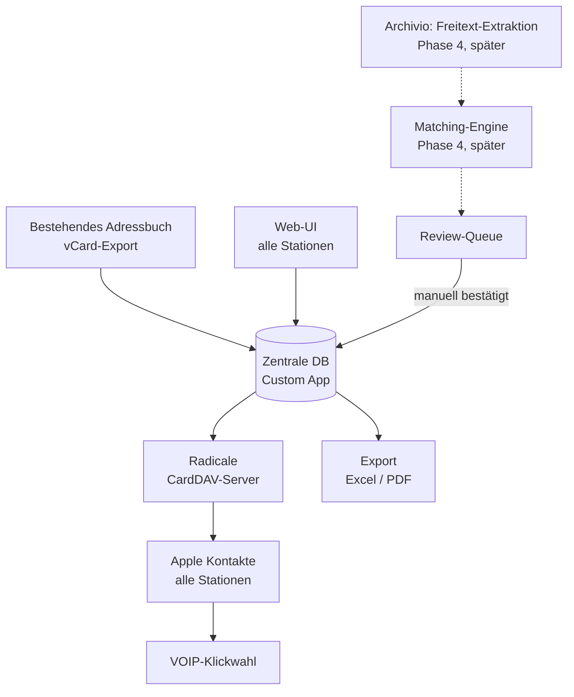
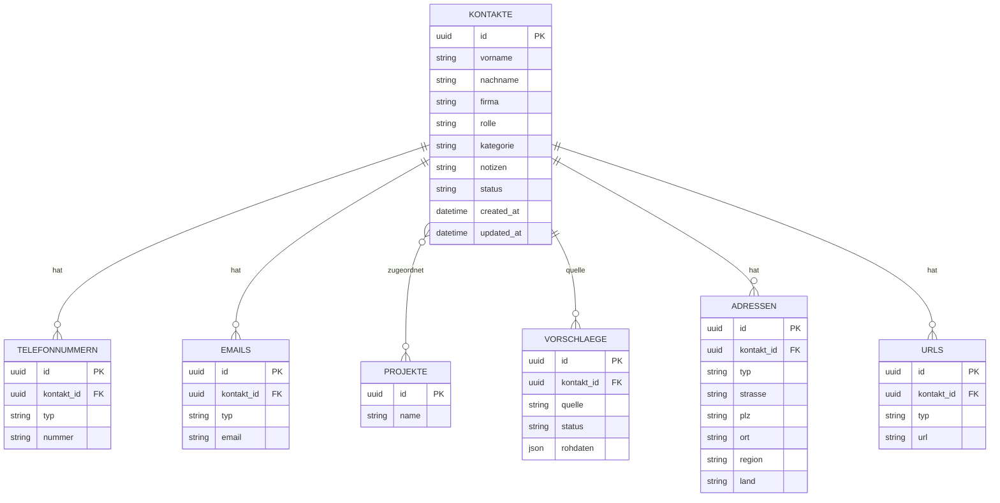

# Rubrica – Technisches Konzept

Dieses Dokument fasst das Konzept für Rubrica, eine zentrale Adressverwaltung, zusammen und dient als Grundlage für die Umsetzung (z. B. mit Claude Code). Es liegt im Repo unter `docs/konzept.md` und wird bei jeder relevanten Änderung/Anpassung nachgeführt, damit es als aktuelle Referenz für alle weiteren Entwicklungsschritte verfügbar bleibt.

Entwicklung erfolgt auf dem Mac Studio (Benutzer `fabio`), das fertige Produkt läuft produktiv auf einem iMac im Büro.

## 1. Ausgangslage

Aktuell wird das Apple Adressbuch genutzt und laufend um Fachplaner und Unternehmer ergänzt. Probleme:

- Neue Kontakte müssen manuell exportiert und bei allen Mitarbeitern importiert werden – kein echter Sync.
- Das Adressbuch ist nie vollständig, weil Mitarbeiter neue Kontakte vergessen anzulegen oder nicht teilen.
- Vorteil des aktuellen Setups, der erhalten bleiben soll: direkte Verbindung zur VOIP-Telefonapp, Klickwahl ohne Kopieren.

## 2. Ziele

1. Zentrale, für alle Stationen automatisch synchronisierte Adressverwaltung.
2. Eingabe/Änderung von jeder Station aus möglich.
3. Automatische Erkennung neuer Adressen aus E-Mails (über Archivio), aber **nie automatisches Überschreiben** bestehender Daten – Vorschläge müssen manuell bestätigt werden.
4. Export als Excel und PDF.
5. Telefonnummern weiterhin per Klick über die VOIP-App wählbar, ohne Copy-Paste.
6. Kontakte können einem oder mehreren Ordnern zugewiesen werden, sichtbar als Gruppen im Apple Adressbuch.
7. Bestehendes Apple Adressbuch (inkl. mehrerer, teils überlappender Mitarbeiter-Kopien) als Grundlage importierbar.

## 3. Architekturübersicht

Kernprinzip: Die selbst gebaute App ist die alleinige Datenquelle ("Single Source of Truth"). Ein selbst gehosteter CardDAV-Server (Radicale) ist nur die Auslieferungsschicht zu Apple Kontakte – kein zweites System, das synchron gehalten werden muss.



Deployment: kein Docker. Die App läuft als natives, über ein `.pkg` installiertes Programm auf einem iMac im Büro – gleiches Vorgehen wie bei Archivio. Python-Interpreter und alle Abhängigkeiten (FastAPI, Radicale, etc.) werden vollständig ins Paket gebündelt, sodass keine separate Python-Installation nötig ist. Backend-App und Radicale laufen als zwei launchd-Dienste (`LaunchDaemons`), die beim Systemstart automatisch starten. Andere Stationen greifen rein lokal über das Büro-LAN zu (Web-UI per Browser, CardDAV-Account in Kontakte.app), z. B. über den Bonjour-Hostnamen des iMacs (`<name>.local`) – keine externe Erreichbarkeit nötig.

Claude Code sollte sich für den Paketierungs-Ansatz (pkg-Build, launchd-Plists, Bibliothekspfade) am bestehenden Code von Archivio orientieren, der unter `/Users/fi/archivio` liegt, damit beide Tools demselben Muster folgen.

## 4. Datenmodell



Wichtig: `VORSCHLAEGE.status` (offen / bestätigt / abgelehnt) ist getrennt von `KONTAKTE.status`. Ein Treffer aus Archivio oder aus dem Import verändert nie direkt einen bestehenden Kontakt, sondern erzeugt einen Eintrag in `VORSCHLAEGE`, der erst nach manueller Bestätigung übernommen wird.

Feldumfang bewusst an der tatsächlichen Nutzung im bestehenden Apple-Adressbuch ausgerichtet (Stichprobe 1538 Kontakte, Stand 22.06.2026): Telefon/E-Mail (fast durchgängig genutzt), Postadresse (1417), Notizen (755) und Homepage/URL (559) sind abgedeckt. Selten genutzte Apple-Felder (Geburtstag, Spitzname, Social-Profile, Instant-Messenger, verwandte Namen — je unter 1.3 % der Kontakte) werden bewusst nicht abgebildet, um das Datenmodell schlank zu halten; bei Bedarf später einfach ergänzbar.

## 5. Komponenten im Detail

### 5.1 Zentrale App (Backend + Web-UI)
- Verwaltet CRUD auf Kontakte (inkl. Telefonnummern, E-Mails, Adressen, URLs, Notizen), Ordner.
- **Direktes Neuanlegen von Kontakten über die Web-UI (`/kontakte/neu`, umgesetzt 2026-07-12).**
  *Revidiert die ursprüngliche Entscheidung „bewusst keine Neuanlage".* Grund: Das Kernproblem des Büros
  ist, dass Kontakte **gar nicht erst erfasst** werden (Wissen bleibt bei Einzelpersonen). „In Kontakte.app
  anlegen → exportieren → importieren" ist genau die Reibung, die das verhindert. Ein Web-Formular zum
  Neuanlegen braucht **keinen** bidirektionalen Sync (Rubrica bleibt Single Source of Truth, pusht einseitig
  zu Apple) und ist daher voll mit dem Architekturprinzip vereinbar. Das Formular ist bewusst minimal und
  mobiltauglich. **Reibungssenker: E-Mail-Signatur einfügen** → `importer/signatur.py` parst sie und füllt
  die Felder vor (danach editierbar). Kontakte werden **direkt angelegt** (kein Freigabe-Gate — Reibung
  würde die Erfassung verhindern), nachträglich korrigierbar; Duplikat-Bereinigung ist Admin-Aufgabe über
  die Review-Queue (Ausbau geplant). Der bisherige Weg (Import aus Kontakte.app, 5.6) bleibt zusätzlich
  bestehen.
- **Feld „Funktion"** (Fachrichtung: Architekt, Bauingenieur, Geologe, div. Planer …) pro Kontakt, damit der
  Chef nach Ansprechpartner-Rolle filtern/exportieren kann. Auswahlliste + Freitext (nicht erzwungen).
  Technisch im bestehenden Feld `kategorie` gespeichert (nur UI-Label „Funktion"), keine DB-Migration.
- Stellt die Review-Queue als UI bereit (offene Vorschläge bestätigen/ablehnen/zusammenführen).
- **Push-Sync nach Radicale** (`sync/radicale.py`): bei jeder Kontakt-Änderung/-Löschung, Ordner-Zuordnung
  oder Vorschlag-Bestätigung schreibt die App die betroffene(n) vCard(s) per CardDAV `PUT` (Legt die
  Adressbuch-Collection bei Bedarf automatisch per `MKCOL` an). Deterministisches UID-Schema:
  `kontakt-{id}` / `projekt-{id}`, keine zusätzliche Spalte nötig. Konfigurierbar über `radicale.*` in
  `config.yaml`, standardmässig deaktiviert (`enabled: false`) — ohne Konfiguration bleibt die App voll
  funktionsfähig, Sync-Fehler (Radicale nicht erreichbar) werden geloggt, nie als Fehler an die Web-UI
  durchgereicht.

### 5.2 CardDAV-Layer (Radicale)
- Leichtgewichtiger, dateibasierter CardDAV-Server, für 6–15 Nutzer ausreichend dimensioniert.
- Wird als Python-Abhängigkeit ins `.pkg` gebündelt und läuft als eigener launchd-Dienst neben dem Backend; wird von der App beschrieben (App schreibt, Radicale liefert nur aus).
- ~~**Kritischer Punkt – zuerst testen:**~~ **Erledigt (2026-07-10):** Apple hält sich bei Kontaktgruppen nicht an den offiziellen vCard4-Standard (`KIND:group`/`MEMBER`), sondern nutzt proprietäre Properties (`X-ADDRESSBOOKSERVER-KIND`, `X-ADDRESSBOOKSERVER-MEMBER`) — per Spike auf einem iPhone verifiziert, Gruppe erscheint korrekt mit Mitgliedern (siehe Abschnitt 9).
- **Wichtiger Praxis-Befund aus dem Spike:** macOS/iOS Kontakte.app führt bei manuellem CardDAV-Setup ("Erweitert") immer eine HTTPS-Autodiscovery auf den Ports 8443/8843/443 durch, unabhängig vom eingetragenen Port. Radicale muss daher HTTPS auf einem dieser Ports anbieten (Dev: selbstsigniertes Zertifikat, automatisch von `scripts/radicale-dev.sh` erzeugt; Produktivbetrieb: siehe Abschnitt 7).
- Auth: `htpasswd` mit bcrypt (`config/radicale.conf.example`), Passwort setzen via `scripts/radicale_set_password.py <user> <passwort>`.

### 5.3 Datenablage
- Konfiguration und SQLite-DB liegen unter `~/Library/Application Support/Rubrica/` (analog zum Archivio-Vorgehen, Pfad steuerbar über `RUBRICA_DATA_DIR`).
- Radicales vCard-Speicher liegt als Unterordner im selben Application-Support-Verzeichnis, damit ein Backup des gesamten Ordners reicht, um alles zu sichern.

### 5.4 Ordner-Zuordnung
- Nutzerseitig "Ordner" genannt, intern weiterhin `KONTAKTE ↔ PROJEKTE` als many-to-many (Tabellen-/Schema-Name bewusst unverändert, siehe unten) — ein Kontakt kann mehreren Ordnern zugeordnet sein.
- Pro Ordner erzeugt die App eine Gruppen-vCard in Radicale (siehe 5.2/5.1), die als Apple-Kontaktgruppe mit Ordnername erscheint. Bei jeder Änderung der Zuordnung (Kontakt bearbeitet, gelöscht, Vorschlag bestätigt) werden sowohl der alte als auch der neue Ordner neu geschrieben, damit Mitglieder korrekt hinzugefügt/entfernt werden.

### 5.5 Archivio-Integration (zurückgestellt auf Phase 4, siehe Abschnitt 8)
- **Wichtig:** Es gibt aktuell noch keine SQL-DB mit fertig strukturierten Adressdaten. Archivio scannt Dokumente auf dem Server sowie E-Mails im Postfach und extrahiert deren Inhalt als Rohtext in eine SQL-DB. Adressdaten sind darin also nicht als eigene Felder vorhanden, sondern höchstens innerhalb des extrahierten Fließtexts auffindbar – z. B. in einer E-Mail-Signatur.
- Das bedeutet: Bevor eine Matching-Engine gebaut werden kann, braucht es zusätzlich eine Extraktionslogik (Erkennung von Name/Firma/Telefon/E-Mail innerhalb von Freitext, z. B. Signaturen). Das ist ein eigenständiges, nicht triviales Teilproblem.
- Dieser Teil ist bewusst kein Bestandteil der ersten Umsetzung, sondern wird erst angegangen, wenn Phase 1–2 stehen. Der bestehende Archivio-Code liegt unter `/Users/fi/archivio` und sollte zu gegebener Zeit als Referenz für das tatsächliche SQL-Schema herangezogen werden, bevor die Extraktions- und Matching-Logik entworfen wird.
- Grundprinzip bleibt aber von Anfang an gültig und sollte im Datenmodell (Tabelle `VORSCHLAEGE`) schon vorgesehen sein: kein Treffer → neuer Vorschlag in der Review-Queue; Treffer mit abweichenden Daten → Änderungsvorschlag, nie automatische Änderung.

### 5.6 Import bestehender Adressbücher — dauerhafter Eingabeweg, nicht nur Einmal-Migration
- Export als `.vcf` aus Kontakte.app (Ablage → Exportieren → vCard exportieren) bei jedem Mitarbeiter. Sowohl Einzel-Export (ein Kontakt) als auch Batch-Export (alle/mehrere Kontakte in einer Datei) werden unterstützt; mehrere Dateien gleichzeitig hochladbar.
- **Import bleibt *ein* Weg der Erfassung (neben der direkten Web-Neuanlage, siehe 5.1), aber der einzige aus Kontakte.app zurück.** Grund: eine echte bidirektionale CardDAV-Synchronisation (Kontakte.app ↔ App) würde das Kernprinzip "nie automatisches Überschreiben" aushebeln, weil Änderungen aus Kontakte.app dann ungeprüft durchschlagen würden. Radicale bleibt nur Ausgaberichtung (App → Apple Kontakte für Klickwahl); die Rückrichtung aus Kontakte.app bleibt bewusst Export → Import → Review-Queue. (Direktes Neuanlegen in der Web-UI umgeht Kontakte.app ganz und ist davon unberührt.)
- Import-Parser mappt vCard-Felder auf das Datenmodell: Name, Firma, Rolle, Telefonnummern, E-Mails, Postadressen (ADR), Homepage/URLs, Notizen (NOTE).
- Da mehrere, teils überlappende Mitarbeiter-Kopien existieren: alle Exporte importieren und dieselbe Review-Queue-Logik (siehe `VORSCHLAEGE`-Tabelle) für die Dedup-/Zusammenführung nutzen – keine zweite Logik nötig, auch nicht für die spätere Archivio-Integration. Matching-Reihenfolge: exakte E-Mail → normalisierte Telefonnummer → exakter Vor-/Nachname.
- Bestehende lokale Gruppen aus dem Import können optional als erste Ordner übernommen werden (Apple-Gruppen-vCards mit `X-ADDRESSBOOKSERVER-KIND`/`MEMBER`, in der Praxis am bestehenden Adressbuch verifiziert: ~32 Gruppen bei 1538 Kontakten).

### 5.7 Export
- **Umgesetzt (Phase 3, 2026-07-12):** `/export` — Nutzer wählt einen Ordner (oder "Alle Kontakte") und
  ein oder mehrere Formate (PDF, CSV, vCard), Rubrica liefert alle gewählten Dateien gebündelt als ein
  einziges ZIP-Archiv (`Ordnername_JJJJ-MM-TT.zip`) zum Download. Erzeugung in `export/generator.py`:
  - **PDF:** formatierte Liste (reportlab), pro Kontakt ein zusammenhängender Block (Name, Firma/Rolle,
    Telefon/E-Mail/Adresse/Web, Notizen), Titel + Datum + Anzahl Kontakte im Kopf.
  - **CSV:** Excel-kompatibel (Semikolon-getrennt, UTF-8 mit BOM für korrekte Umlaut-Darstellung in Excel).
  - **vCard:** eine `.vcf`-Datei mit allen Kontakten des Ordners (Mehrfach-vCard, direkt per Doppelklick in
    Kontakte.app importierbar) — nutzt dieselbe `kontakt_zu_vcard()`-Funktion wie der CardDAV-Sync
    (`sync/radicale.py`), keine doppelte Formatierungslogik.
  - Neue Abhängigkeit `reportlab==5.0.0` in `requirements.txt`.

## 6. Vorgeschlagener Tech-Stack

| Bereich | Empfehlung | Begründung |
|---|---|---|
| Backend | Python + FastAPI | Gleiche Sprache wie Radicale, gut dokumentiert, KI-Coding-freundlich |
| Datenbank | SQLite | Datenmenge ist klein (Kontaktliste), keine separate DB-Infrastruktur nötig, einfache Backups. Bei Bedarf später auf Postgres migrierbar |
| Frontend | Server-seitig gerendert (Jinja2 + htmx) | Keine npm-Build-Pipeline nötig, für einen Solo-Entwickler mit KI-Unterstützung deutlich einfacher zu warten als eine SPA |
| CardDAV | Radicale | Siehe 5.2, als Python-Abhängigkeit gebündelt |
| Paketierung | `.pkg`-Installer, launchd-Dienste | Gleiches Vorgehen wie bei Archivio, kein Docker, läuft nativ auf dem iMac |
| Datenablage | `~/Library/Application Support/Rubrica/` | Konfiguration und SQLite-DB an einem Ort, einfaches Backup |
| Versionierung | Git, Remote auf GitHub | Wie gewünscht |

Dies ist ein Startvorschlag – bei Bedarf anpassbar, insbesondere falls beim Bauen mit Claude Code eine andere Sprache bevorzugt wird.

## 7. Zugriff & Sicherheit

Geklärt: Zugriff erfolgt vorerst ausschließlich lokal im Büro-LAN, kein Remote-Zugriff nötig. Web-UI weiterhin per einfachem HTTP im lokalen Netz erreichbar (`<name>.local`), kein Reverse-Proxy nötig.

**Revidiert durch Phase-2-Spike-Erfahrung:** Für CardDAV (Radicale) ist HTTPS entgegen der ursprünglichen Annahme doch nötig — macOS/iOS Kontakte.app führt beim Account-Setup immer eine HTTPS-Autodiscovery durch (siehe Abschnitt 5.2/9), unabhängig von der eigentlichen LAN-only-Anforderung. Für den Produktivbetrieb auf dem iMac:
- **Auth**: `htpasswd`/bcrypt (siehe 5.2) statt der im Spike genutzten `auth.type=none`.
- **TLS-Zertifikat**: Dev nutzt ein selbstsigniertes Zertifikat (pro Gerät manuell als vertrauenswürdig bestätigen). Für den echten Rollout auf mehreren Stationen sollte ein einmal erzeugtes, auf allen Stationen als vertrauenswürdig hinterlegtes Zertifikat verwendet werden (z. B. eigene lokale CA à la `mkcert`), damit nicht jede Station einzeln den "nicht vertrauenswürdig"-Dialog bestätigen muss. Das ist ein offener Punkt für die Rollout-Phase, noch nicht umgesetzt.

## 8. Phasenplan

| Phase | Inhalt |
|---|---|
| 0 | Import bestehender Adressbücher (alle Mitarbeiter-Exporte) + Dedup über Review-Queue |
| 1 | Zentrale DB + Web-UI für manuelle Eingabe (löst das Kernproblem bereits) |
| 2 | Radicale-Anbindung inkl. Apple-Gruppen-Spike – **zuerst isoliert testen**, bevor der Rest darauf aufbaut |
| 3 ✅ | Export-Funktionen (PDF/CSV/vCard, pro Ordner, siehe Abschnitt 5.7) |
| 4 *(zurückgestellt)* | Archivio-Integration: zunächst Schema-Sichtung + Extraktionslogik für Adressdaten aus Freitext, danach Matching-Engine. Startet erst, wenn Phase 1–3 stehen und Archivios SQL-Schema bekannt ist |

## 9. Offene Punkte / Risiken

- ~~Apple-Gruppen-Kompatibilität (proprietäres vCard-Format) – größtes technisches Risiko, früh verifizieren.~~
  **GELÖST (2026-07-10).** Radicale (3.7.6, läuft unter Python 3.9) verarbeitet und liefert eine
  Gruppen-vCard (`X-ADDRESSBOOKSERVER-KIND:group` + `-MEMBER:urn:uuid:...`) über CardDAV korrekt aus
  (`MKCOL`/`PUT`/`GET`/`PROPFIND` per curl verifiziert). **Auf einem iPhone als CardDAV-Account
  eingerichtet erscheint die Gruppe "Rubrica Testprojekt" korrekt mit den zugehörigen Testkontakten
  als Mitglieder** — das Kernrisiko ist damit ausgeräumt.
- ~~macOS Kontakte.app holt nach dem Verbinden nie die Kontaktdaten ab (nur Discovery, nie `REPORT`) –
  eingeordnet als macOS-Einschränkung.~~ **URSACHE GEFUNDEN & GELÖST (2026-07-10). War kein macOS-Bug,
  sondern ein nicht-konformes TLS-Zertifikat.** Symptom: macOS Kontakte.app (Sonoma 14.8.2) machte nach
  dem Verbinden nur Discovery (`PROPFIND`/`OPTIONS`), nie einen `REPORT`; die Kontakte blieben leer, teils
  Meldung "Accountname/Passwort konnte nicht überprüft werden". iOS funktionierte, weil man dort das
  Zertifikat per Dialog **manuell** bestätigt (Trust-Override) — der macOS-Sync-Daemon
  (`dataaccessd`/`contactsd`) validiert dagegen strikt und bricht **vor** dem `REPORT` still ab.
  - **Beleg (Unified Log, `trustd`):** `[com.apple.securityd:ev] Leaf has invalid basic constraints`.
  - **Ursache im Detail:** Das selbstsignierte Zertifikat aus dem alten Build-Skript
    (`openssl req -x509 -days 3650`, nur `subjectAltName`) verletzte gleich mehrere Apple-Anforderungen an
    TLS-Server-Zertifikate: (a) **keine `basicConstraints`** → ein Zertifikat, das zugleich eigener
    Trust-Anchor und Server-Leaf ist, scheitert an Apples Constraint-Prüfung; (b) **kein
    `extendedKeyUsage=serverAuth`**; (c) **Gültigkeit 3650 Tage** statt der von Apple erzwungenen
    **≤ 398 Tage** (support.apple.com/en-us/HT211025).
  - **Lösung:** neues `scripts/generate-cert.sh` erzeugt eine lokale **CA** + davon signiertes **Leaf**
    (`CA:FALSE`, `keyUsage=digitalSignature,keyEncipherment`, `extendedKeyUsage=serverAuth`, SAN mit
    Hostname, 397 Tage, SHA-256/RSA-2048) — dasselbe Prinzip wie `mkcert`. Radicale liefert die Full-Chain
    (Leaf + CA) aus; die CA wird auf jedem Client **einmalig** als vertrauenswürdig markiert. Der
    `.pkg`-Postinstall (`scripts/build-pkg.sh`) erzeugt das Zertifikat und markiert die CA per
    `security add-trusted-cert -d -r trustRoot -k /Library/Keychains/System.keychain` automatisch als
    vertrauenswürdig (läuft als root → kein Dialog). Vorteil des CA-Modells: Das jährlich ablaufende Leaf
    (398-Tage-Grenze) kann erneuert werden, ohne dass auf den Clients erneut vertraut werden muss.
  - **Manuell (bestehende Installation ohne neuen Postinstall, z. B. Mac Studio):** einmalig
    `sudo security add-trusted-cert -d -r trustRoot -p ssl -k /Library/Keychains/System.keychain \
    "~/Library/Application Support/Rubrica/radicale-tls/ca-cert.pem"`, danach alten CardDAV-Account
    entfernen und neu anlegen.
  - **Zu beachten beim "Erweitert"-CardDAV-Setup:** macOS prüft bei der Accountverifizierung immer HTTPS
    auf 8443/8843/443, unabhängig vom eingetragenen Port (s. `config/radicale.conf.example`).
- ~~macOS Kontakte.app synchronisiert nach behobenem TLS zwar fehlerfrei die Discovery, startet aber den
  eigentlichen Inhalts-Sync nicht.~~ **GELÖST (2026-07-12).** War ein macOS-Client-Zustandsproblem, kein
  Rubrica-/Radicale-Fehler — durch Vanilla-Radicale-Gegentest zweifelsfrei von Rubrica getrennt (siehe unten).
  - **Beweis, dass Rubrica nicht die Ursache war:** (a) iOS synchronisiert mit identischen Serverantworten
    zuverlässig; (b) ein frisches, leeres Vanilla-Radicale (kein Rubrica-Code, nur 2 Testkontakte) zeigte
    exakt dasselbe Symptom — Discovery ja, `REPORT` nie; (c) per mitschreibendem TLS-Proxy verifiziert, dass
    macOS die von ChatGPT vermuteten Properties (`getcontenttype`/`getcontentlength` auf der Collection)
    nie abfragt — diese Hypothese war falsch.
  - **Tatsächliche Ursache:** angesammelter Client-Zustand nach mehreren Setup-Versuchen (8 verwaiste, leere
    CardDAV-Quellen unter `~/Library/Application Support/AddressBook/Sources/`) **plus** Account-Setup im
    Modus **"Erweitert" mit explizitem Serverpfad** (`/fi/kontakte/`) — das führte dazu, dass `contactsd`
    nach der Discovery keinen Inhalts-Sync ansetzte.
  - **Lösung:** (1) Account entfernen, Kontakte.app beenden, `killall contactsd`; (2) alle leeren,
    verwaisten CardDAV-Quellen aus `~/Library/Application Support/AddressBook/Sources/` entfernen
    (Quellen mit 0 Karten und vorhandener `AddressBook-v22.abcddb`; echte lokale Kontakte-Quellen mit
    Karteninhalt nicht anfassen); (3) Account **neu und im Modus "Manuell"** anlegen, **nur mit dem
    Hostnamen** (`Fabio-Mac-Studio.local`), **ohne Port und ohne Pfad** — macOS macht dann die
    CardDAV-Autodiscovery über `/.well-known/carddav` selbst (wie beim iPhone) statt über einen fest
    eingetragenen Collection-Pfad. Danach sendete macOS sofort 28 `addressbook-multiget`-REPORTs und alle
    1535 Kontakte + 32 Gruppen kamen korrekt an (verifiziert in Kontakte.app auf dem Mac Studio).
  - **Für den iMac-Rollout:** Account **immer** im Modus "Manuell" mit nur dem Hostnamen anlegen, nie
    "Erweitert" mit explizitem Pfad — auch wenn beide Modi denselben Server ansprechen, verhält sich
    `contactsd` beim Auslösen des initialen Inhalts-Syncs unterschiedlich.
- Archivio enthält aktuell keine strukturierten Adressdaten, nur extrahierten Freitext (z. B. Mail-Signaturen) – die Extraktion daraus ist ein eigenständiges Teilproblem und bewusst auf später verschoben.
- pkg-Bündelung von Python + Radicale + Abhängigkeiten sollte sich eng am bestehenden Archivio-Build orientieren, um doppelte Lösungswege für dasselbe Problem zu vermeiden.
- SQLite-Eignung bei tatsächlicher Nutzung validieren (bei diesem Datenvolumen unkritisch, aber gleichzeitige Schreibzugriffe im Auge behalten).

## 10. Repo-Struktur

Flache Struktur analog zu Archivio (`/Users/fi/archivio`) statt einer `backend/frontend/packaging`-Aufteilung – gleiches, bewährtes Muster für Config-Loading, DB-Connection und spätere `.pkg`-Paketierung, keine doppelten Lösungswege für dasselbe Problem.

```
rubrica/
├── docs/
│   └── konzept.md          # dieses Dokument
├── config/
│   └── settings.py          # config.yaml laden/speichern (RUBRICA_DATA_DIR)
├── db/
│   ├── schema.sql
│   ├── connection.py
│   └── migrations.py
├── web/
│   ├── main.py               # FastAPI App-Factory
│   ├── contacts.py
│   ├── projects.py
│   ├── review.py
│   ├── templates/
│   └── static/
├── scripts/
│   ├── setup.sh
│   └── dev.sh
├── tests/
├── requirements.txt
├── config.yaml.example
├── CLAUDE.md
└── README.md
```

Radicale-Anbindung, launchd-Plists und `.pkg`-Build (Phase 2 ff.) werden zu gegebener Zeit ergänzt, sobald diese Phasen beginnen.

## 11. Umsetzungsstatus

| Phase | Status |
|---|---|
| 0 – Import + Dedup | Grundfunktion steht (vCard-Upload, Matching, Review-Queue) |
| 1 – Zentrale DB + Web-UI | Grundfunktion steht (Kontakte/Ordner-CRUD, Live-Suche) |
| 2 – Radicale/CardDAV | Sync-Engine steht (Push bei Kontakt-/Ordner-Änderung, echte htpasswd-Auth), end-to-end gegen echten Radicale-Server verifiziert |
| 3 – Export (Excel/PDF) | Noch nicht begonnen |
| 4 – Archivio-Integration | Zurückgestellt |

Umgesetzt und end-to-end im Browser verifiziert (2026-07-10):
- Kontakte bearbeiten/löschen inkl. mehrerer Telefonnummern/E-Mails/Adressen/URLs, Notizen, Zuordnung zu Ordnern. Bewusst keine manuelle Neuanlage in der App (siehe 5.1) — Anlage erfolgt in Kontakte.app + Import
- Ordner anlegen/löschen, Live-Suche/Filter (Name, Firma, Ordner, Kategorie) per htmx (nutzerseitig "Ordner", intern weiterhin Tabelle `projekte`, siehe 5.4)
- vCard-Import (mehrere Dateien gleichzeitig, Einzel- wie Batch-Export, inkl. Apple-Gruppen-Erkennung über `X-ADDRESSBOOKSERVER-KIND`/`MEMBER`), Feldabdeckung inkl. Postadresse/Homepage/Notizen an echter Nutzung im bestehenden Adressbuch verifiziert (siehe Abschnitt 4)
- Dedup-Matching (E-Mail exakt → Telefonnummer normalisiert → Vor-/Nachname) erzeugt `vorschlaege`, nie direkte Änderung
- Review-Queue: Bestätigen mergt (ergänzt Telefonnummern/E-Mails/Adressen/URLs, hängt Notizen an, überschreibt nur leere Felder), Ablehnen verwirft — bestehende Kontakte werden nie automatisch verändert
- Batch-Import mit 60 synthetischen Kontakten performant und korrekt (Test); 20 pytest-Tests (Schema, Foreign-Keys, Import/Matching/Merge, Radicale-Sync) grün
- Radicale-Spike: Apple-Gruppen-Anzeige auf iPhone erfolgreich bestätigt (siehe Abschnitt 9), Kernrisiko von Phase 2 damit ausgeräumt
- **Sync-Engine** (`sync/radicale.py`): Kontakt- und Ordner-vCards werden bei jeder relevanten Änderung
  (Kontakt bearbeiten/löschen, Ordner anlegen/löschen, Vorschlag bestätigen) automatisch per CardDAV `PUT`/
  `DELETE` nach Radicale geschrieben, inkl. automatischem Anlegen der Adressbuch-Collection (`MKCOL`) beim
  ersten Zugriff. End-to-end mit echtem Radicale-Server (htpasswd/bcrypt-Auth, HTTPS) verifiziert: Kontakt
  anlegen+Ordner zuordnen → beide vCards korrekt in Radicale; Kontakt löschen → vCard entfernt, Ordner-
  Gruppe automatisch ohne den Kontakt neu geschrieben. Konfiguration über `radicale.*` in `config.yaml`,
  standardmässig deaktiviert.
- **Umbenennung (2026-07-10):** "Projekte" heisst nutzerseitig jetzt durchgehend "Ordner" (Navigation, Formulare,
  URLs `/ordner*`) — Datenbank-Tabellen (`projekte`, `kontakte_projekte`) und interne IDs (`projekt-{id}` im
  Radicale-UID-Schema) bleiben bewusst unverändert, um kein Migrationsrisiko ohne Nutzen einzugehen.
- **Echter Datenimport (2026-07-10):** `scripts/import_from_contacts_app.py` importiert alle Kontakte + Gruppen
  direkt per AppleScript aus Kontakte.app (statt manuellem vCard-Export), verifiziert am tatsächlichen
  Adressbuch: 1503 von 1504 Kontakten erfolgreich übernommen (1 mit defekter Legacy-Quoted-Printable-Kodierung
  übersprungen), 32 Ordner mit korrekter Mitgliederzuordnung — Zahlen decken sich exakt mit den echten
  Kontakte.app-Gruppen. Datenschutz-Vorkehrung: keine Zwischendateien, keine vollständigen Datensätze im
  Skript-Output, nur zusammenfassende Zahlen.
  **Bug gefunden + behoben:** Apple's gruppierte vCard-Properties (`item2.X-ABADR:...`, Punkt vor dem
  Property-Namen für benutzerdefinierte Adress-Labels) wurden von der Zeilenfaltungs-Reparatur des Skripts
  fälschlich als verwaiste Fortsetzungszeile erkannt und an die vorherige Adresse angehängt — betraf
  vereinzelt Adressfelder. Regex korrigiert (erlaubt jetzt Punkte im Property-Namen), DB komplett neu
  importiert. Zusätzlich in `sync/radicale.py` eine RFC-6350-Zeilenfaltung (`_fold`) ergänzt, da einzelne
  besonders lange vCard-Zeilen von Radicale mit 400 Bad Request abgelehnt wurden. Nach beiden Fixes: alle
  1503 Kontakte + 32 Ordner fehlerfrei nach Radicale synchronisiert (1535 Einträge per CardDAV verifiziert).
- **Test-`.pkg` mit launchd + Zertifikat (2026-07-10):** `scripts/build-pkg.sh` baut `Rubrica Server.app`
  (kein eingebettetes Python — venv wird beim Erststart mit System-Python aufgebaut, analog Archivios
  Fallback-Pfad) und ein `.pkg`, das zwei launchd-Dienste einrichtet (`ch.strut.rubrica.server`,
  `ch.strut.rubrica.radicale`), beim Erststart automatisch ein selbstsigniertes Zertifikat sowie ein
  zufälliges CardDAV-Passwort erzeugt (`htpasswd`/bcrypt) und die Zugangsdaten per Dialog + Textdatei anzeigt.
  Lokal auf dem Mac Studio installiert und verifiziert (beide Dienste laufen, Web-UI erreichbar, Sync gegen
  echten Radicale-Server bestätigt). Zwei Stolpersteine dabei gefunden und behoben:
  - macOS' PackageKit "relocated" die Installation in den lokalen Build-Ordner (`dist/…`) statt nach
    `/Applications`, weil dort zum Installationszeitpunkt bereits ein Bundle mit derselben
    `CFBundleIdentifier` lag (Launch-Services-Erkennung) — `build-pkg.sh` entfernt den Build-Ordner jetzt
    nach dem Packen und hebt dessen Launch-Services-Registrierung explizit auf.
  - Beide launchd-Dienste teilen sich ein venv und starten gleichzeitig (`RunAtLoad`) — ohne Sperre
    entstand eine Race Condition beim venv-Aufbau. Behoben mit einer einfachen `mkdir`-basierten Lockdatei
    in der gemeinsamen Bootstrap-Logik.
- **CardDAV-Zertifikat + macOS-Sync vollständig gelöst (2026-07-12):** siehe Abschnitt 9 für die Details
  (Ursache: nicht Apple-konformes selbstsigniertes Zertifikat + macOS-Client-Zustand/Setup-Modus). Neue
  `scripts/generate-cert.sh` (lokale CA + konformes Leaf) ist in `build-pkg.sh` eingebaut; der Postinstall
  erzeugt das Zertifikat und markiert die CA automatisch systemweit als vertrauenswürdig (`security
  add-trusted-cert` als root, kein manueller Dialog nötig). `.pkg` mit diesem Fix neu gebaut
  (`dist/rubrica-server-0.1.0-test.pkg`) und Payload/Postinstall verifiziert (`generate-cert.sh` enthalten,
  `add-trusted-cert`-Aufruf vorhanden). End-to-End auf dem Mac Studio bestätigt: Account im Modus
  "Manuell" (nur Hostname) synchronisiert alle 1535 Karten + 32 Gruppen korrekt in Kontakte.app.
  `scripts/fix-macos-trust.sh` steht für bestehende Installationen ohne neuen Postinstall bereit.
- **Eingebettetes Python im `.pkg` (2026-07-12):** `build-pkg.sh` lädt jetzt analog zu Archivios
  `build_server_app.sh` universelles Python 3.13 via `python-build-standalone` (arm64 **und** x86_64,
  Cache über MD5-Hash von `requirements.txt`), installiert alle Abhängigkeiten hinein und kopiert beide
  Umgebungen nach `Contents/Frameworks/rubrica-python-{arch}/` ins App-Bundle (Ad-hoc-Codesignierung der
  `.so`/`.dylib`/Binaries für Gatekeeper). Beide Launcher (`Rubrica Server`, `Rubrica Radicale`) bevorzugen
  das eingebettete Python der laufenden Architektur (`uname -m`) und fallen nur, falls für diese Architektur
  kein eingebettetes Python mitgeliefert wurde, auf den alten System-Python+venv-Weg zurück
  (`bootstrap_venv.sh`, unverändert als Fallback erhalten). Grund: **kein** Abhängigkeit mehr von der
  jeweils auf iMac/Mac Studio installierten Python-Version — iMac und Mac Studio können unterschiedliche
  oder gar keine Python-Installation haben, ohne dass es zu Versions-/Paketkonflikten kommt.
  `.pkg`-Größe dadurch von 46 KB auf ~92 MB gestiegen (zwei komplette Python-Laufzeiten inkl. FastAPI/
  Uvicorn/Radicale/bcrypt/vobject) — bewusst in Kauf genommen für Robustheit, deutlich kleiner als Archivios
  ~290 MB (kein PyMuPDF/PyObjC). Lokal auf dem Mac Studio installiert und verifiziert: beide Prozesse laufen
  nachweislich unter `Contents/Frameworks/rubrica-python-arm64/bin/python3` (nicht mehr unter dem alten
  venv), Web-UI (200) und CardDAV (207) funktionieren, alle 1503 Kontakte/32 Ordner/1535 Radicale-Karten
  unverändert erhalten. Altes, jetzt ungenutztes venv unter `~/Library/Application Support/Rubrica/.venv`
  entfernt.
  - **Stolperstein:** `launchctl bootstrap` im Postinstall-Skript schlug fehl, als das `.pkg` über
    `osascript … with administrator privileges` (GUI-Passwortdialog statt Terminal-`sudo`) installiert
    wurde — die LaunchAgents wurden zwar als Plist geschrieben, aber nicht in die GUI-Sitzung eingehängt.
    Workaround: einmalig manuell `launchctl bootstrap gui/<uid> <plist>` je Dienst. Für den iMac-Rollout
    testen, ob Installation über Doppelklick/Finder (statt osascript-Fernsteuerung) davon unberührt ist.
- **Produktiv-Rollout auf dem iMac erfolgreich abgeschlossen (2026-07-12):** `.pkg` auf dem iMac (Intel,
  x86_64) installiert und verifiziert — eingebettetes Python lief dort korrekt nativ (`rubrica-python-x86_64`,
  Python 3.13.14), bestätigt die Architektur-Unabhängigkeit des neuen Pakets. Mehrere Probleme dabei
  gefunden und gelöst:
  - **Port-Konflikt mit Archivio:** Archivio belegt auf dem iMac bereits Port 8000 (Rubricas alter
    Standard-Port) — `[Errno 48] address already in use`. Rubricas Web-Server-Port fest auf **8001** verlegt
    (`config.yaml.example`, `scripts/dev.sh`, `scripts/build-pkg.sh`-Launcher), um Konflikte auf gemeinsam
    genutzten Maschinen generell zu vermeiden.
  - **Datenmigration Mac Studio → iMac:** Da jede `.pkg`-Installation eine eigene, leere Datenbank anlegt,
    mussten die 1503 Kontakte/32 Ordner separat übertragen werden (kein SSH-Zugriff auf den iMac gewünscht).
    Neues `scripts/restore-data-archive.sh`: spielt ein Archiv (`rubrica.db` + Radicale-vCards) auf der
    Zielinstallation ein, ohne Zertifikat/Passwort/Config anzutasten (bleiben pro Maschine eigenständig).
  - **Altes, nicht-konformes Zertifikat auf dem iMac:** Von einem noch früheren Installationsversuch (vor
    dem CA-Fix) lag dort schon ein `cert.pem` — der Postinstall überspringt die Neuerzeugung, wenn die
    Datei schon existiert. Musste einmalig manuell nachgeholt werden (altes Zertifikat entfernen,
    `generate-cert.sh` erneut ausführen, neue CA per `security add-trusted-cert` vertrauen — sowohl auf dem
    iMac selbst als auch auf dem Mac Studio, da jede Installation ihre **eigene** CA erzeugt und Clients
    diese jeweils einzeln vertrauen müssen).
  - **Kritischer Bug in `restore-data-archive.sh` gefunden (behoben, siehe Commit `3a4629b`):** Das Skript
    legte den Collection-Ordner per rohem `mkdir` an, statt Radicales eigene MKCOL-Verarbeitung zu nutzen.
    Dadurch fehlte `.Radicale.props` (Tag `VADDRESSBOOK`) — PROPFIND/Login/Discovery funktionierten
    einwandfrei (207 OK), aber macOS Kontakte.app erkannte den Ordner mangels korrektem
    `resourcetype: CR:addressbook` nicht als synchronisierbares Adressbuch und sendete nie einen `REPORT`.
    Exaktes Symptom wie das ursprüngliche TLS-Problem aus Abschnitt 9 ("Verbindung klappt, Kontakte bleiben
    leer"), diesmal aber bei sauberem Zertifikat — wichtige Erkenntnis: **dasselbe äußere Symptom kann
    mehrere unabhängige Ursachen haben** (TLS-Vertrauen UND Collection-Metadaten UND Cache-Timeout, siehe
    unten, traten in dieser Session alle drei nacheinander auf). Fix: `restore-data-archive.sh` schreibt
    `.Radicale.props` jetzt automatisch nach, falls sie fehlt.
  - **Cache-Kaltstart-Timeout:** Nach dem Löschen von `.Radicale.cache` (Teil der Migration) brauchte
    Radicale beim ersten Zugriff auf die 1535-Karten-Collection auf dem iMac **138 bzw. 55 Sekunden**, um
    den Cache neu aufzubauen (`PROPFIND ... depth 1` im Log) — deutlich über dem Timeout, den macOS'
    Kontakte-Sync-Daemon offenbar zulässt, wodurch der Client vor Erhalt der (verspäteten) Antwort bereits
    aufgegeben hatte. Nach einmaligem "Aufwärmen" des Caches lief ein erneuter Versuch (Kontakte.app
    beenden, `contactsd` zurücksetzen, neu öffnen) in Sekunden durch. Merke für künftige Migrationen: nach
    dem Löschen von `.Radicale.cache` einmal die Collection warm anfragen (z. B. per `curl PROPFIND`),
    bevor man macOS synchronisieren lässt.
  - **Ergebnis:** Kontakte.app auf dem Mac Studio synchronisiert erfolgreich gegen den Rubrica-Server auf
    dem iMac (`Windows.local`) — alle 1503 Kontakte angekommen, verifiziert über den lokalen
    AddressBook-Sources-Cache (`~/Library/Application Support/AddressBook/Sources/*/Metadata/*.abcdp`).
    Der lokale Testserver auf dem Mac Studio wurde gestoppt (nicht deinstalliert), um Doppelbetrieb mit
    divergierenden Datenständen zu vermeiden — der iMac ist jetzt die einzige aktive Instanz.
- **Phase 3: Export (2026-07-12):** siehe Abschnitt 5.7 für die Details. Neues Modul `export/generator.py`
  (PDF/CSV/vCard-Erzeugung, 5 Tests in `tests/test_export.py`) + `web/export.py` (Route `/export`,
  Formular- und ZIP-Logik) + Template `web/templates/export.html` + Nav-Link in `base.html`. Lokal end-to-end
  gegen echte Daten getestet (Ordner mit 10 echten Kontakten exportiert, alle drei Formate im ZIP korrekt:
  CSV mit korrekten Umlauten, 10 vCards, gültiges PDF). Alle 27 Tests (bestehend + neu) grün.
  **Hinweis:** Das produktive `.pkg` auf dem iMac/Mac Studio wurde noch nicht mit der neuen
  `reportlab`-Abhängigkeit neu gebaut/installiert — vor Nutzung des Exports in Produktion `.pkg` neu bauen
  und ausrollen (`scripts/build-pkg.sh`, danach Installation + `.venv`/eingebettetes Python aktualisieren).

Bekannte Einschränkung: Entwicklungsumgebung läuft unter Python 3.9 (Systemversion) statt der ursprünglich in Abschnitt 6 vermuteten 3.12 — FastAPI-Routenparameter deshalb mit `typing.Optional[int]` statt `int | None` (siehe `CLAUDE.md`). Dies betrifft nur die lokale Entwicklungsumgebung; das produktive `.pkg` bringt sein eigenes Python 3.13 mit und ist davon unabhängig.

- **Erfassung / Kontakt-Neuanlage (2026-07-12):** siehe Abschnitt 5.1. `importer/signatur.py` (Signatur →
  Kontaktfelder, 10 Tests), `web/contacts.py` (Routen `/kontakte/neu`, `/kontakte/signatur-parsen`), Templates
  `contact_new.html` + Fragment `_kontakt_felder.html`, Feld „Funktion" in Neuanlage/Bearbeiten/Liste/Filter/
  Export. 3 Web-Smoke-Tests, alle 40 Tests grün. Lokal end-to-end verifiziert (Anlegen inkl.
  Signatur-Vorbefüllung, Funktion in Liste, danach sauber gelöscht — Produktiv-DB unverändert).

**Strategische Richtung (mit Nutzer abgestimmt, 2026-07-12):** Kernproblem ist *Wissenszentralisierung* —
Kontakte werden nicht erfasst, darum kennt z. B. die Geschäftsleitung Ansprechpartner nicht. Zwei Hebel:
(1) reibungslose *aktive* Erfassung (Web-Formular + Signatur-Einfügen, umgesetzt) und (2) *passive* Erfassung
via Archivio (E-Mail-Signaturen → **gefilterte Vorschläge** in die Review-Queue, `vorschlaege.quelle='archivio'`
existiert bereits; hohe Präzision statt Vollständigkeit, um Explosion der Kontaktzahl zu vermeiden — nächster
grösserer Schritt). Bewusst *nicht* jetzt: Notion-Pendenzen-Kopplung (eher umständlich als hilfreich; höchstens
später dünne Einbahn-Brücke Kontakte→Notion, wenn Schmerz bewiesen) und schwere Rechte-Bürokratie (Freigabe-Gate
vor Erfassung würde die Adoption abwürgen). Später: sicherer Remote-Zugriff für On-Site-Erfassung.

- **`.pkg`-Rebuild + Testinstall auf dem Mac Studio (2026-07-12):** Neues `.pkg` mit `reportlab` gebaut und
  probeweise installiert (Dienste danach bewusst wieder gestoppt — der iMac bleibt die einzige aktive
  Instanz). Dabei **Bug gefunden + behoben:** `scripts/build-pkg.sh` kopierte das `export/`-Verzeichnis nie
  ins App-Bundle (`Contents/Resources`), obwohl `web/export.py` es importiert — Symptom: Server-Dienst
  startete nicht (`ModuleNotFoundError: No module named 'export'`, Exit 1). Nach Fix neu gebaut und
  vollständig end-to-end gegen die echte `.pkg`-Installation verifiziert: Export (PDF/CSV/vCard), Signatur-
  Parsen und Kontakt-Neuanlage funktionieren alle korrekt mit dem eingebetteten Python; Produktions-DB
  danach unverändert (Testkontakt angelegt und wieder gelöscht, 1503→1503).
- **Archivio-Anbindung, erste Stufe (2026-07-12):** Neues Modul `archivio_bridge/anbindung.py` (bewusst
  nicht `archivio` genannt, um Verwechslung mit dem Referenzprojekt `/Users/fi/archivio` zu vermeiden) liest
  read-only aus Archivios SQLite-DB (Tabellen `documents`/`document_content`/`mails`, bereits text-
  extrahierte E-Mails) und erzeugt daraus Kandidaten für die Review-Queue. Strenger Vorfilter wie in der
  strategischen Richtung festgelegt: nur Absender mit ≥ `archivio.min_mails` E-Mails (echte Korrespondenz),
  nur wenn die per `importer/signatur.py` geparste Signatur **sowohl Telefonnummer als auch Firma** enthält,
  bereits vorhandene E-Mail-Adressen werden übersprungen. Schreibt selbst nichts — neue Route
  `/review/archivio-vorschau` (GET, reine Vorschau ohne DB-Schreibzugriff) + `/review/archivio-uebernehmen`
  (POST, erzeugt `vorschlaege` mit `quelle='archivio'`, dublettensicher gegenüber bereits offenen Archivio-
  Vorschlägen). Konfiguration über `archivio.db_path`/`archivio.min_mails` in `config.yaml` (leer = aus).
  9 Tests (5 Modul-Ebene mit synthetischer Archivio-Test-DB, 4 Web-Ebene inkl. Dubletten-Schutz).
  **Gegen echte Daten verifiziert** (Projekt `215_Flurhofstrasse`, 156 bereits gescannte E-Mails, 17
  Absender, 9 mit ≥2 Mails): **2 valide Kandidaten** gefunden, beide mit Name/Firma/Telefon/Mail, aus
  echter mehrfacher Korrespondenz (5 bzw. 26 Mails) — Verifikation bewusst nur mit aggregierten
  Kennzahlen (Feld vorhanden ja/nein, Längen, Anzahl), nie mit echtem Klartext im Chat/Terminal-Output.
  Kleine Fundgrösse liegt am Datenbestand: bisher ist nur ein einziges Projekt-Postfach in Archivio
  gescannt (`mail_scan_config.active=1` bei nur 3 von 59 Ordnern) — mehr Ertrag braucht mehr gescannte
  Postfächer in Archivio selbst (liegt ausserhalb von Rubrica).

**Strategische Richtung (mit Nutzer abgestimmt, 2026-07-12):** Kernproblem ist *Wissenszentralisierung* —
Kontakte werden nicht erfasst, darum kennt z. B. die Geschäftsleitung Ansprechpartner nicht. Zwei Hebel:
(1) reibungslose *aktive* Erfassung (Web-Formular + Signatur-Einfügen, umgesetzt) und (2) *passive* Erfassung
via Archivio (E-Mail-Signaturen → **gefilterte Vorschläge** in die Review-Queue, umgesetzt siehe oben;
hohe Präzision statt Vollständigkeit, um Explosion der Kontaktzahl zu vermeiden). Bewusst *nicht* jetzt:
Notion-Pendenzen-Kopplung (eher umständlich als hilfreich; höchstens später dünne Einbahn-Brücke
Kontakte→Notion, wenn Schmerz bewiesen) und schwere Rechte-Bürokratie (Freigabe-Gate vor Erfassung würde
die Adoption abwürgen). Später: sicherer Remote-Zugriff für On-Site-Erfassung.

- **Menubar-App ersetzt zwei separate launchd-Dienste (2026-07-12):** Bisher liefen Web-Server und Radicale
  als zwei unabhaengige launchd-Dienste (`ch.strut.rubrica.server`, `ch.strut.rubrica.radicale`) ohne jede
  sichtbare Statusanzeige. Problem: Kein Weg zu sehen, ob Rubrica laeuft, und ein einfaches Beenden des
  Prozesses haette wegen `KeepAlive=true` sofort zu einem Neustart durch launchd gefuehrt — ein
  Drüber-Installieren waere daher nicht sauber gewesen. Neues `menubar/app.py` (rumps, analog zu Archivios
  `menubar/server_app.py`): **ein einziger** launchd-Job startet diese Menubar-App, die Web-Server und
  Radicale selbst als Kindprozesse startet, ueberwacht (Neustart bei Absturz, ersetzt die launchd-KeepAlive-
  Ueberwachung, die jetzt nur noch den Wrapper selbst betrifft) und sauber beendet. Menu zeigt
  Live-Status (🟢/🔴) fuer beide Dienste, "Rubrica öffnen", "Datenordner öffnen", "Beenden" (stoppt beide
  Kindprozesse, entlaedt den eigenen launchd-Job via `launchctl bootout`, beendet sich selbst — kein
  ungewollter Neustart durch KeepAlive). Neue Abhaengigkeit `rumps==0.4.0` (+ pyobjc automatisch via pip),
  Groessenzuwachs im `.pkg` nur ~5 MB. `scripts/build-pkg.sh` entsprechend umgebaut: nur noch ein Launcher-
  Binary ("Rubrica Server", jetzt Wrapper statt direktem `uvicorn`-Exec), Postinstall installiert nur noch
  einen LaunchAgent und raeumt den alten `ch.strut.rubrica.radicale`-Agent von frueheren Installationen auf
  (Migration). End-to-end auf dem Mac Studio installiert und verifiziert: Status-Icon sichtbar, beide
  Kindprozesse laufen (Web-UI 200, Radicale-TLS OK), "Beenden" funktioniert sauber.
- **Kontaktliste: Ordner-Seitenleiste mit Drag & Drop (2026-07-12):** `/kontakte` umgebaut auf ein
  zweispaltiges Layout (Ordner-Sidebar links mit Kontakt-Anzahl je Ordner, Kontaktliste rechts) — angelehnt
  an Kontakte.app, wie vom Nutzer gewuenscht, weil das Zuordnen zu Ordnern vorher nicht auffindbar war
  (nur ueber den Bearbeiten-Link, der optisch nicht auffiel). Kontakt-Zeilen sind per HTML5 Drag&Drop auf
  einen Ordner in der Sidebar ziehbar (Ziehgriff „⠿"); Ablegen ruft eine neue Route
  `POST /kontakte/{id}/ordner/{ordner_id}/hinzufuegen` auf, die den Ordner **ergaenzt** statt die gesamte
  Zuordnung zu ersetzen (neue `db.queries.add_kontakt_projekt`, additive Variante zu `set_kontakt_projekte`).
  Volle Kontrolle (inkl. Entfernen aus Ordnern) bleibt zusaetzlich ueber das bestehende Bearbeiten-Formular
  moeglich. 4 neue Tests, gegen echte Produktionsdaten auf dem Mac Studio end-to-end verifiziert (Testkontakt
  angelegt, per simuliertem Drop einem echten Ordner zugeordnet, Tag erschien korrekt in der Liste, danach
  sauber geloescht).

- **Bugfix Drag&Drop blockierte Bearbeiten-Klick (2026-07-12):** Nutzer-Feedback nach dem ersten Live-Test
  auf dem iMac: Ordner-Sidebar und Drag&Drop funktionierten, aber der Klick auf den Kontaktnamen (Link zu
  `/kontakte/{id}/bearbeiten`) reagierte nicht zuverlässig. Ursache: `draggable="true"` stand auf der ganzen
  `<tr>` — jede minimale Mausbewegung beim Klicken wurde vom Browser als Drag-Start statt als Klick
  interpretiert. Fix: `draggable` nur noch auf dem Ziehgriff-`<td>` ("⠿"), der Rest der Zeile (inkl.
  Name-Link) ist normal klickbar. Live auf dem Mac Studio verifiziert.
- **Einstellungsseite (2026-07-12):** Nutzer-Feedback: `archivio.db_path` liess sich nicht setzen, weil die
  `archivio:`-Sektion in bestehenden `config.yaml`-Dateien (vor dieser Funktion installiert) schlicht fehlte
  und Hand-Editieren von YAML fehleranfaellig ist. Neue Seite `/einstellungen` (`web/settings.py` +
  `templates/settings.html`, Nav-Link): Formular für Archivio-Datenbankpfad + Mindestanzahl E-Mails,
  schreibt über die bestehende `config.settings.save()` (deep-merge, legt fehlende Sektionen automatisch an).
  3 Tests. Live gegen die echte Mac-Studio-Config verifiziert: bestehende `config.yaml` ohne `archivio:`-
  Sektion wurde korrekt ergänzt, andere Werte (Radicale-Zugangsdaten etc.) blieben unangetastet; danach
  `archivio.db_path` auf den echten lokalen Pfad (`/Users/fi/archivio/archivio.db`) gesetzt — Archivio-Vorschau
  darüber erfolgreich aufgerufen (0 Kandidaten, weil die zuvor gefundenen 2 Personen als Kontakt bereits
  vorhanden sind — Dublettenschutz korrekt gegen den vollen 1503-Kontakte-Bestand verifiziert).

- **Bearbeiten-Flyover + Drag-Ziehbild + Archivio-Qualitaet (2026-07-12, Nutzer-Feedback nach Live-Test):**
  - **Bearbeiten war nicht auffindbar:** Name-Klick funktionierte fuer den Nutzer trotz Drag&Drop-Fix nicht
    zuverlaessig. Neu: expliziter **„Bearbeiten"-Button links vom „Löschen"-Button**, oeffnet den Kontakt als
    **Flyover** (Modal-Overlay) statt Seitenwechsel — per htmx-Fragment (`kontakt_bearbeiten_modal.html`,
    gemeinsames Formular-Include `_kontakt_bearbeiten_form.html`, geteilt mit der Vollseite
    `contact_form.html`, keine doppelte Logik). Name in der Liste ist wieder reiner Text (kein Link mehr) -
    Bearbeiten geht ausschliesslich ueber den Button.
  - **Ziehbild beim Drag&Drop:** Der Ziehgriff „⠿" allein zeigte waehrend des Ziehens nicht, welcher Kontakt
    gerade bewegt wird. Custom Drag-Image (`DataTransfer.setDragImage`) zeigt jetzt „⠿ Vorname Nachname"
    waehrend des Ziehens.
  - **Archivio-Kandidatenqualitaet grundlegend ueberarbeitet** nach konkretem Nutzer-Feedback (Funktions-
    zeile als Name, fehlende E-Mail, Newsletter-Text als Firma, unplausible Telefonnummer, bereits
    bestehende Kontakte tauchten erneut auf):
    - **Ursachenklaerung (Nutzerfrage beantwortet):** Ja, Archivio hat einen Signatur-Entferner. In
      `archivio/scanner/mail_scanner.py` schneidet `_strip_signature` bei IMAP-gescannten Mails ALLES nach
      einer Grussformel ("Freundliche Grüsse" etc.) ab, bevor der Text ueberhaupt in Archivios DB landet —
      der Rohtext wird nirgends aufbewahrt, das ist fuer IMAP-Mails unwiederbringlich (nur bei
      `.eml`-Dateien im Dateisystem-Scan bleibt die Signatur intakt). Erklaert fehlende E-Mails/Namen direkt
      an der Quelle, nicht in Rubrica behebbar.
    - **`importer/signatur.py` gehaertet:** Regex-Bug behoben (`\bdipl\.\b` matcht nie, wenn ein Punkt von
      einem Leerzeichen gefolgt wird — beide Nicht-Wortzeichen, keine Wortgrenze); Namens-Erkennung lehnt
      jetzt Zeilen ab, die wie eine Funktion/Titel aussehen (`_ROLLE_KENNUNG`-Ueberschneidung); Firma auf
      max. 80 Zeichen begrenzt (verhindert Newsletter-Absaetze als "Firma"); neue
      `_ist_plausible_telefonnummer()` verwirft Zahlenfolgen mit ungueltiger Schweizer Vorwahl (zweite
      Ziffer nach der Landes-/Trunk-Null darf nie 0 oder 1 sein — verwirft z. B. "011 8544 000").
    - **`archivio_bridge/anbindung.py` strenger gefasst:** verlangt jetzt ALLE VIER Felder vollstaendig
      (Vor- UND Nachname, Firma, mind. 1 Telefonnummer, mind. 1 E-Mail) statt nur Telefon+Firma; probiert
      bis zu 5 Mails je Absender (nicht nur die neueste), falls eine durch Archivios Signatur-Kappung
      unvollstaendig ist; Dublettenpruefung jetzt zusaetzlich per Name und Telefonnummer (nicht nur E-Mail).
    - 9 neue/aktualisierte Tests fuer `archivio_bridge` (16 fuer `signatur.py` insgesamt), alle synthetisch
      nachgebaut aus den konkret gemeldeten Faellen. Live gegen den echten Archivio-Bestand erneut verifiziert:
      0 Kandidaten (vorher 2, beide waren unvollstaendig — jetzt korrekt durch den strengeren Filter
      ausgeschlossen).

- **Archivio-Vorschau: einzeln übernehmen/ablehnen (2026-07-12):** Nutzer-Feedback — bisher gab es nur
  "alle übernehmen". Neue Routen `POST /review/archivio-uebernehmen-einzeln` und
  `POST /review/archivio-ablehnen` (je per E-Mail-Adresse identifiziert, die durch die strenge
  Vollstaendigkeitspruefung immer vorhanden ist). Ablehnen legt einen Vorschlag mit Status `abgelehnt` an
  (kein neuer Mechanismus noetig — nutzt die bestehende `vorschlaege`-Tabelle); `archivio_bridge`s
  Dublettenpruefung wurde erweitert, sodass **jeder** bereits per Archivio-Vorschau entschiedene Kandidat
  (uebernommen ODER abgelehnt) nicht wieder auftaucht, nicht nur bereits bestehende Kontakte. "Alle
  übernehmen" bleibt zusaetzlich als Bulk-Option bestehen. 6 neue Tests.
- **Ordner: Bearbeiten-Button (2026-07-12):** `/ordner` hatte keine Umbenennen-Funktion. Neue Route
  `POST /ordner/{id}/bearbeiten` (`db.queries.rename_projekt`) + inline editierbarer Name in der Liste
  (JS-Toggle zwischen Anzeige und Eingabefeld, kein Flyover noetig fuer ein einzelnes Feld). 3 Tests.
- **Ordner-Checkliste im Kontakt-Formular als vertikale Liste:** war ein zeilenweise umbrechendes Grid,
  bei 30+ Ordnern unuebersichtlich (Nutzer-Feedback, Screenshot). Jetzt eine scrollbare, alphabetisch
  sortierte vertikale Liste (`.ordner-checkliste`, max-height 220px) — in `_kontakt_bearbeiten_form.html`
  und `_kontakt_felder.html` (Neu-Anlegen) gleichermassen.

**Offener Punkt (zurueckgestellt, 2026-07-12): Archivio-Mailscanner soll Signatur separat speichern.**
Wurde ausfuehrlich mit dem Nutzer besprochen, aber bewusst NICHT von mir umgesetzt — der Nutzer aendert
Archivio (anderes, produktiv laufendes Projekt unter `/Users/fi/archivio`) selbst, separat von dieser
Session. Gesammeltes Wissen fuer naechstes Mal:
  - **Ursache** (siehe oben): `scanner/mail_scanner.py::_strip_signature` schneidet bei IMAP-gescannten
    Mails alles nach der Grussformel ab, bevor der Text in `document_content.content` landet. Der Rohtext
    wird nirgends aufbewahrt (`build_email_record` haelt `raw_text` nur transient im Speicher,
    `save_mail_to_db` persistiert ausschliesslich `cleaned_text`).
  - **Vom Nutzer vorgeschlagene Loesungsansaetze** (beide in Archivio, nicht Rubrica):
    (a) **Empfohlen:** die abgeschnittene Signatur zusaetzlich SEPARAT speichern (neue Spalte/Tabelle in
    Archivios Schema, z. B. `document_content.signature` oder eigene Tabelle) — `content` bleibt fuer
    Archivios eigene Volltextsuche wie bisher signaturbereinigt (kein Rauschen durch wiederkehrende
    Signaturen/Disclaimer), Rubrica koennte die separate Signatur-Spalte gezielt lesen.
    (b) **Einfacher, aber mit Trade-off:** Signatur gar nicht mehr abschneiden, `content` enthaelt
    kuenftig die volle Mail — weniger Aenderungsaufwand, aber Archivios eigene Suche bekommt mehr
    Rauschen (Nutzer: "hinnehmbar").
  - **Reichweite:** wirkt so oder so nur auf KUENFTIG gescannte Mails. Die bereits gescannten 156 Mails
    (nur in der lokalen Mac-Studio-Dev-Instanz, nicht die eigentliche Produktivinstanz auf dem iMac) bleiben
    mit abgeschnittener Signatur — Rohtext ist fuer die bereits verarbeiteten IMAP-Mails nicht mehr
    rekonstruierbar. Der Nutzer wird das Postfach auf dem iMac (Produktivinstanz) zu gegebener Zeit selbst
    neu scannen lassen, nachdem die Archivio-Aenderung dort umgesetzt ist.
  - Sobald das erledigt ist: `archivio_bridge/anbindung.py` muss ggf. angepasst werden, um die neue
    Signatur-Quelle zu lesen (falls Archivio Option (a) waehlt, eine zusaetzliche Spalte in der SQL-Abfrage
    beruecksichtigen statt `_letzte_zeilen(dc.content)`).

Bekannte Einschränkung: Entwicklungsumgebung läuft unter Python 3.9 (Systemversion) statt der ursprünglich in Abschnitt 6 vermuteten 3.12 — FastAPI-Routenparameter deshalb mit `typing.Optional[int]` statt `int | None` (siehe `CLAUDE.md`). Dies betrifft nur die lokale Entwicklungsumgebung; das produktive `.pkg` bringt sein eigenes Python 3.13 mit und ist davon unabhängig.

Nächste sinnvolle Schritte: Notion-aehnliches visuelles Redesign (siehe naechster Abschnitt, in Arbeit) und
Behebung des gemeldeten Layout-Versatzes (Nav-Balken vs. zentrierter Content). Danach: neues `.pkg` auf dem
iMac installieren; unter „Einstellungen" `archivio.db_path` setzen, falls Archivio dort genutzt werden soll.
(z. B. einzelne Kandidaten abwaehlen koennen, statt alles-oder-nichts).
