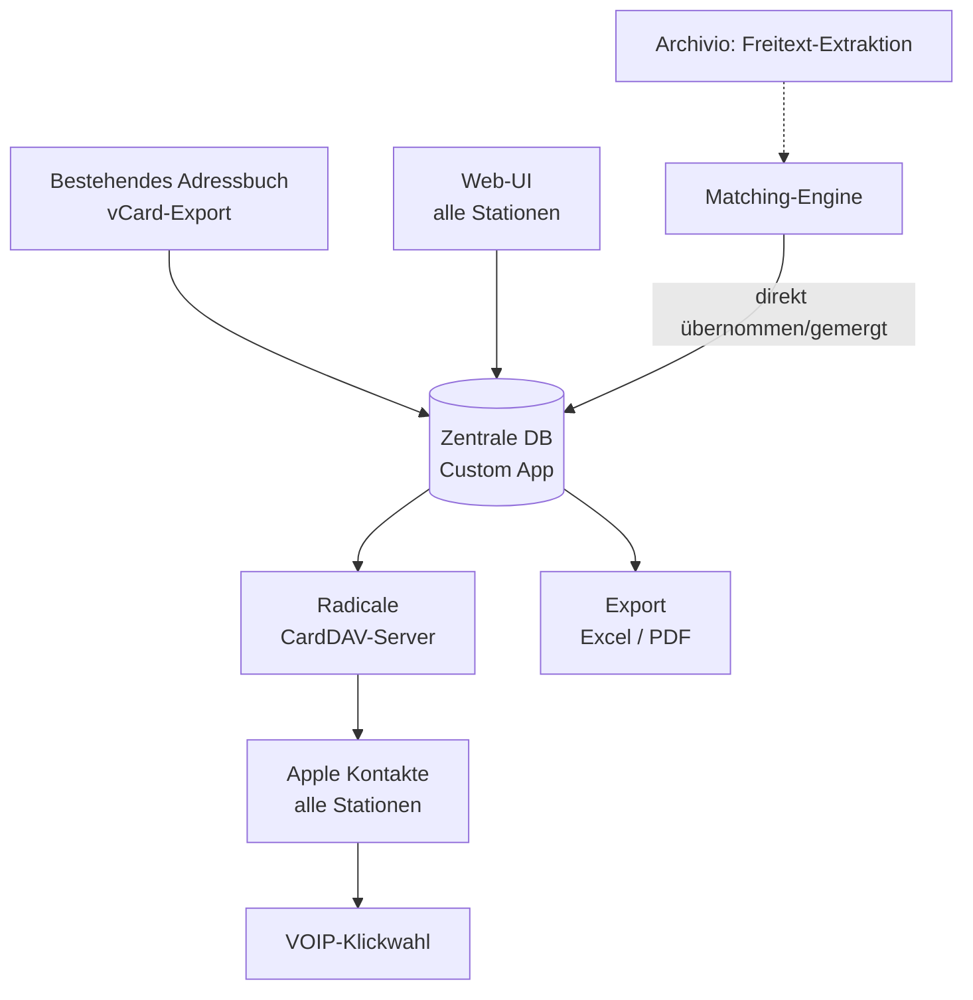
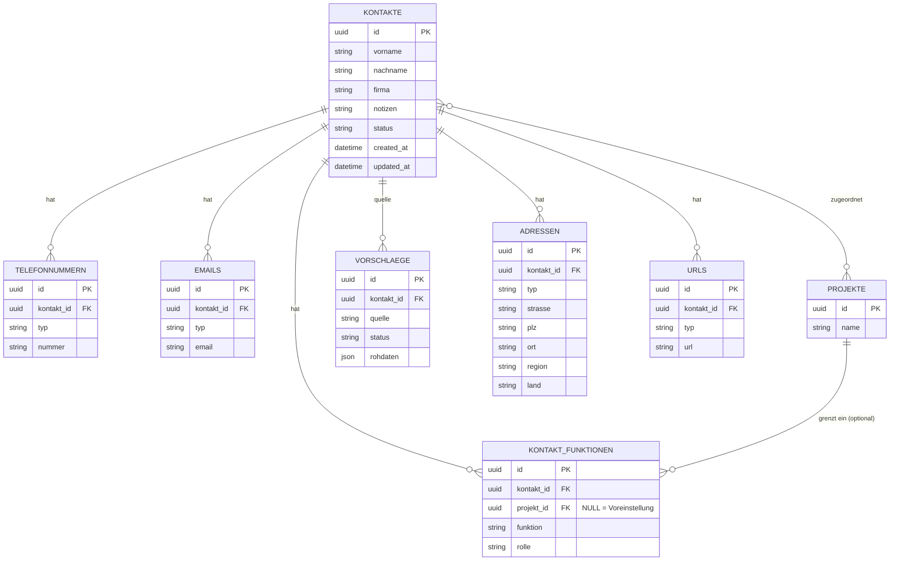

# Rubrica – Technisches Konzept

Dieses Dokument fasst das Konzept für Rubrica, eine zentrale Adressverwaltung, zusammen und dient als Grundlage für die Umsetzung (z. B. mit Claude Code). Es liegt im Repo unter `docs/konzept.md` und wird bei jeder relevanten Änderung/Anpassung nachgeführt, damit es als aktuelle Referenz für alle weiteren Entwicklungsschritte verfügbar bleibt.

Entwicklung erfolgt auf einem Entwicklungs-Mac, das fertige Produkt läuft produktiv auf einem Server-Mac im Büro.

## 1. Ausgangslage

Aktuell wird das Apple Adressbuch genutzt und laufend um Fachplaner und Unternehmer ergänzt. Probleme:

- Neue Kontakte müssen manuell exportiert und bei allen Mitarbeitern importiert werden – kein echter Sync.
- Das Adressbuch ist nie vollständig, weil Mitarbeiter neue Kontakte vergessen anzulegen oder nicht teilen.
- Vorteil des aktuellen Setups, der erhalten bleiben soll: direkte Verbindung zur VOIP-Telefonapp, Klickwahl ohne Kopieren.

## 2. Ziele

1. Zentrale, für alle Stationen automatisch synchronisierte Adressverwaltung.
2. Eingabe/Änderung von jeder Station aus möglich.
3. Automatische Erkennung neuer Adressen aus E-Mails (über Archivio), aber **nie automatisches Überschreiben** bestehender Daten – Vorschläge müssen manuell bestätigt werden.
4. Export als Excel und PDF.
5. Telefonnummern weiterhin per Klick über die VOIP-App wählbar, ohne Copy-Paste.
6. Kontakte können einem oder mehreren Ordnern zugewiesen werden, sichtbar als Gruppen im Apple Adressbuch.
7. Bestehendes Apple Adressbuch (inkl. mehrerer, teils überlappender Mitarbeiter-Kopien) als Grundlage importierbar.

## 3. Architekturübersicht

Kernprinzip: Die selbst gebaute App ist die alleinige Datenquelle ("Single Source of Truth"). Ein selbst gehosteter CardDAV-Server (Radicale) ist nur die Auslieferungsschicht zu Apple Kontakte – kein zweites System, das synchron gehalten werden muss.


```mermaid
flowchart TB
    A[Bestehendes Adressbuch<br/>vCard-Export] --> D
    B[Web-UI<br/>alle Stationen] --> D
    C[Archivio: Freitext-Extraktion] -.-> M[Matching-Engine]
    M -->|direkt übernommen/gemergt| D[(Zentrale DB<br/>Custom App)]
    D --> R[Radicale<br/>CardDAV-Server]
    R --> K[Apple Kontakte<br/>alle Stationen]
    K --> V[VOIP-Klickwahl]
    D --> E[Export<br/>Excel / PDF]
```

Deployment: kein Docker. Die App läuft als natives, über ein `.pkg` installiertes Programm auf einem Mac im Büro – gleiches Vorgehen wie bei der Referenzimplementierung Archivio (siehe `CLAUDE.md`). Python-Interpreter und alle Abhängigkeiten (FastAPI, Radicale, etc.) werden vollständig ins Paket gebündelt, sodass keine separate Python-Installation nötig ist. Backend-App und Radicale laufen als Kindprozesse einer Menubar-App, die über einen launchd-Dienst beim Systemstart automatisch startet. Andere Stationen greifen rein lokal über das Büro-LAN zu (Web-UI per Browser, CardDAV-Account in Kontakte.app), z. B. über den Bonjour-Hostnamen des Server-Macs (`<name>.local`) – keine externe Erreichbarkeit nötig.

Claude Code sollte sich für den Paketierungs-Ansatz (pkg-Build, launchd-Plists, Bibliothekspfade) am bestehenden Code der Referenzimplementierung Archivio orientieren (siehe `CLAUDE.md` für den Pfad), damit beide Tools demselben Muster folgen.

## 4. Datenmodell


```mermaid
erDiagram
    KONTAKTE ||--o{ TELEFONNUMMERN : hat
    KONTAKTE ||--o{ EMAILS : hat
    KONTAKTE }o--o{ PROJEKTE : zugeordnet
    KONTAKTE ||--o{ VORSCHLAEGE : quelle
    KONTAKTE ||--o{ ADRESSEN : hat
    KONTAKTE ||--o{ URLS : hat
    KONTAKTE ||--o{ KONTAKT_FUNKTIONEN : hat
    PROJEKTE ||--o{ KONTAKT_FUNKTIONEN : "grenzt ein (optional)"
    KONTAKTE {
        uuid id PK
        string vorname
        string nachname
        string firma
        string notizen
        string status
        datetime created_at
        datetime updated_at
    }
    TELEFONNUMMERN {
        uuid id PK
        uuid kontakt_id FK
        string typ
        string nummer
    }
    EMAILS {
        uuid id PK
        uuid kontakt_id FK
        string typ
        string email
    }
    ADRESSEN {
        uuid id PK
        uuid kontakt_id FK
        string typ
        string strasse
        string plz
        string ort
        string region
        string land
    }
    URLS {
        uuid id PK
        uuid kontakt_id FK
        string typ
        string url
    }
    KONTAKT_FUNKTIONEN {
        uuid id PK
        uuid kontakt_id FK
        uuid projekt_id FK "NULL = Voreinstellung"
        string funktion
        string rolle
    }
    PROJEKTE {
        uuid id PK
        string name
    }
    VORSCHLAEGE {
        uuid id PK
        uuid kontakt_id FK
        string quelle
        string status
        json rohdaten
    }
```

Wichtig: `VORSCHLAEGE.status` (offen / bestätigt / abgelehnt) ist getrennt von `KONTAKTE.status`. Ein Treffer aus Archivio oder aus dem Import verändert nie direkt einen bestehenden Kontakt, sondern erzeugt einen Eintrag in `VORSCHLAEGE`, der erst nach manueller Bestätigung übernommen wird.

Feldumfang bewusst an der tatsächlichen Nutzung im bestehenden Apple-Adressbuch ausgerichtet (Stichprobe 1538 Kontakte, Stand 22.06.2026): Telefon/E-Mail (fast durchgängig genutzt), Postadresse (1417), Notizen (755) und Homepage/URL (559) sind abgedeckt. Selten genutzte Apple-Felder (Geburtstag, Spitzname, Social-Profile, Instant-Messenger, verwandte Namen — je unter 1.3 % der Kontakte) werden bewusst nicht abgebildet, um das Datenmodell schlank zu halten; bei Bedarf später einfach ergänzbar.

## 5. Komponenten im Detail

### 5.1 Zentrale App (Backend + Web-UI)
- Verwaltet CRUD auf Kontakte (inkl. Telefonnummern, E-Mails, Adressen, URLs, Notizen), Ordner.
- **Direktes Neuanlegen von Kontakten über die Web-UI (`/kontakte/neu`, umgesetzt 2026-07-12).**
  *Revidiert die ursprüngliche Entscheidung „bewusst keine Neuanlage".* Grund: Das Kernproblem des Büros
  ist, dass Kontakte **gar nicht erst erfasst** werden (Wissen bleibt bei Einzelpersonen). „In Kontakte.app
  anlegen → exportieren → importieren" ist genau die Reibung, die das verhindert. Ein Web-Formular zum
  Neuanlegen braucht **keinen** bidirektionalen Sync (Rubrica bleibt Single Source of Truth, pusht einseitig
  zu Apple) und ist daher voll mit dem Architekturprinzip vereinbar. Das Formular ist bewusst minimal und
  mobiltauglich. **Reibungssenker: E-Mail-Signatur einfügen** → `importer/signatur.py` parst sie und füllt
  die Felder vor (danach editierbar). Kontakte werden **direkt angelegt** (kein Freigabe-Gate — Reibung
  würde die Erfassung verhindern), nachträglich korrigierbar. Der bisherige Weg (Import aus Kontakte.app,
  5.6) bleibt zusätzlich bestehen.
- **Felder „Funktion" und „Rolle"** (Fachrichtung: Architekt, Bauingenieur, Geologe, div. Planer … / Titel
  innerhalb der Fachrichtung: Projektleiter, Bauleiter …) pro Kontakt, damit der Chef nach Ansprechpartner-
  Rolle filtern/exportieren kann. Auswahlliste + Freitext (nicht erzwungen). Seit 2026-08-14 (Nutzer-Vorgabe)
  in eigener Tabelle `kontakt_funktionen` statt als Scalar-Spalten auf `kontakte`: ein Kontakt kann mehrere
  Funktion/Rolle-**Paare** gleichzeitig haben (z. B. „291 Architekt/in" mit Rolle „Projektleiter" UND
  „291 Bauleitung" mit Rolle „Gestalterische Bauleitung"). `projekt_id` grenzt ein Paar optional auf ein
  Projekt ein — `NULL` ist die Voreinstellung, die ausserhalb eines bestimmten Projekts gilt und auch die
  einzige Ebene ist, die die aktuelle Version bereits vollständig bedient (die Web-UI zur
  projektspezifischen Zuweisung selbst ist eine Folgeversion). Export (PDF/CSV) zeigt einen Kontakt mit
  mehreren Funktionen unter jeder einzelnen — eine Adressliste wird über die Funktion durchsucht, nicht über
  den Namen. Die alten Spalten `kontakte.kategorie`/`kontakte.rolle` bleiben in `schema.sql` bestehen (kein
  `ALTER TABLE DROP COLUMN` auf produktivem Bestand), werden aber von der App nicht mehr gelesen oder
  beschrieben — die Migration `2026-08-14_kontakt_funktionen_uebernehmen` übernimmt ihren Inhalt einmalig als
  erste Voreinstellungs-Zeile.
- **Push-Sync nach Radicale** (`sync/radicale.py`): bei jeder Kontakt-Änderung/-Löschung, Ordner-Zuordnung
  oder Vorschlag-Bestätigung schreibt die App die betroffene(n) vCard(s) per CardDAV `PUT` (Legt die
  Adressbuch-Collection bei Bedarf automatisch per `MKCOL` an). Deterministisches UID-Schema:
  `kontakt-{id}` / `projekt-{id}`, keine zusätzliche Spalte nötig. Konfigurierbar über `radicale.*` in
  `config.yaml`, standardmässig deaktiviert (`enabled: false`) — ohne Konfiguration bleibt die App voll
  funktionsfähig, Sync-Fehler (Radicale nicht erreichbar) werden geloggt, nie als Fehler an die Web-UI
  durchgereicht.

### 5.2 CardDAV-Layer (Radicale)
- Leichtgewichtiger, dateibasierter CardDAV-Server, für 6–15 Nutzer ausreichend dimensioniert.
- Wird als Python-Abhängigkeit ins `.pkg` gebündelt und läuft als eigener launchd-Dienst neben dem Backend; wird von der App beschrieben (App schreibt, Radicale liefert nur aus).
- ~~**Kritischer Punkt – zuerst testen:**~~ **Erledigt (2026-07-10):** Apple hält sich bei Kontaktgruppen nicht an den offiziellen vCard4-Standard (`KIND:group`/`MEMBER`), sondern nutzt proprietäre Properties (`X-ADDRESSBOOKSERVER-KIND`, `X-ADDRESSBOOKSERVER-MEMBER`) — per Spike auf einem iPhone verifiziert, Gruppe erscheint korrekt mit Mitgliedern (siehe Abschnitt 9).
- **Wichtiger Praxis-Befund aus dem Spike:** macOS/iOS Kontakte.app führt bei manuellem CardDAV-Setup ("Erweitert") immer eine HTTPS-Autodiscovery auf den Ports 8443/8843/443 durch, unabhängig vom eingetragenen Port. Radicale muss daher HTTPS auf einem dieser Ports anbieten (Dev: selbstsigniertes Zertifikat, automatisch von `scripts/radicale-dev.sh` erzeugt; Produktivbetrieb: siehe Abschnitt 7).
- Auth: `htpasswd` mit bcrypt (`config/radicale.conf.example`), Passwort setzen via `scripts/radicale_set_password.py <user> <passwort>`.

### 5.3 Datenablage
- Konfiguration und SQLite-DB liegen unter `~/Library/Application Support/Rubrica/` (analog zum Archivio-Vorgehen, Pfad steuerbar über `RUBRICA_DATA_DIR`).
- Radicales vCard-Speicher liegt als Unterordner im selben Application-Support-Verzeichnis, damit ein Backup des gesamten Ordners reicht, um alles zu sichern.

### 5.4 Ordner-Zuordnung
- Nutzerseitig "Ordner" genannt, intern weiterhin `KONTAKTE ↔ PROJEKTE` als many-to-many (Tabellen-/Schema-Name bewusst unverändert, siehe unten) — ein Kontakt kann mehreren Ordnern zugeordnet sein.
- Pro Ordner erzeugt die App eine Gruppen-vCard in Radicale (siehe 5.2/5.1), die als Apple-Kontaktgruppe mit Ordnername erscheint. Bei jeder Änderung der Zuordnung (Kontakt bearbeitet, gelöscht, Vorschlag bestätigt) werden sowohl der alte als auch der neue Ordner neu geschrieben, damit Mitglieder korrekt hinzugefügt/entfernt werden.

### 5.5 Archivio-Integration (zurückgestellt auf Phase 4, siehe Abschnitt 8)
- **Wichtig:** Es gibt aktuell noch keine SQL-DB mit fertig strukturierten Adressdaten. Archivio scannt Dokumente auf dem Server sowie E-Mails im Postfach und extrahiert deren Inhalt als Rohtext in eine SQL-DB. Adressdaten sind darin also nicht als eigene Felder vorhanden, sondern höchstens innerhalb des extrahierten Fließtexts auffindbar – z. B. in einer E-Mail-Signatur.
- Das bedeutet: Bevor eine Matching-Engine gebaut werden kann, braucht es zusätzlich eine Extraktionslogik (Erkennung von Name/Firma/Telefon/E-Mail innerhalb von Freitext, z. B. Signaturen). Das ist ein eigenständiges, nicht triviales Teilproblem.
- Dieser Teil ist bewusst kein Bestandteil der ersten Umsetzung, sondern wird erst angegangen, wenn Phase 1–2 stehen. Der bestehende Archivio-Code (siehe `CLAUDE.md` für den Pfad) sollte zu gegebener Zeit als Referenz für das tatsächliche SQL-Schema herangezogen werden, bevor die Extraktions- und Matching-Logik entworfen wird.
- Grundprinzip bleibt aber von Anfang an gültig und sollte im Datenmodell (Tabelle `VORSCHLAEGE`) schon
  vorgesehen sein: kein Treffer → neuer Kontakt; Treffer mit abweichenden Daten → nie destruktive
  Änderung, nur Ergänzung leerer Felder (siehe docs/CHANGELOG-INTERN.md, "Review-Queue komplett entfernt").

### 5.6 Import bestehender Adressbücher — dauerhafter Eingabeweg, nicht nur Einmal-Migration
- Export als `.vcf` aus Kontakte.app (Ablage → Exportieren → vCard exportieren) bei jedem Mitarbeiter. Sowohl Einzel-Export (ein Kontakt) als auch Batch-Export (alle/mehrere Kontakte in einer Datei) werden unterstützt; mehrere Dateien gleichzeitig hochladbar.
- **Import bleibt *ein* Weg der Erfassung (neben der direkten Web-Neuanlage, siehe 5.1), aber der einzige aus Kontakte.app zurück.** Grund: eine echte bidirektionale CardDAV-Synchronisation (Kontakte.app ↔ App) würde das Kernprinzip "nie automatisches Überschreiben" aushebeln, weil Änderungen aus Kontakte.app dann ungeprüft durchschlagen würden. Radicale bleibt nur Ausgaberichtung (App → Apple Kontakte für Klickwahl); die Rückrichtung aus Kontakte.app bleibt bewusst Export → Import → direkte Übernahme (siehe docs/CHANGELOG-INTERN.md, "Review-Queue komplett entfernt"). (Direktes Neuanlegen in der Web-UI umgeht Kontakte.app ganz und ist davon unberührt.)
- Import-Parser mappt vCard-Felder auf das Datenmodell: Name, Firma, Rolle, Telefonnummern, E-Mails, Postadressen (ADR), Homepage/URLs, Notizen (NOTE).
- Da mehrere, teils überlappende Mitarbeiter-Kopien existieren: alle Exporte importieren und dieselbe Dedup-/Merge-Logik (siehe `VORSCHLAEGE`-Tabelle, `queries.merge_kontakt`) nutzen – keine zweite Logik nötig, auch nicht für die Archivio-Integration. Matching-Reihenfolge: exakte E-Mail → normalisierte Telefonnummer → exakter Vor-/Nachname.
- Bestehende lokale Gruppen aus dem Import können optional als erste Ordner übernommen werden (Apple-Gruppen-vCards mit `X-ADDRESSBOOKSERVER-KIND`/`MEMBER`, in der Praxis am bestehenden Adressbuch verifiziert: ~32 Gruppen bei 1538 Kontakten).

### 5.7 Export
- **Umgesetzt (Phase 3, 2026-07-12):** `/export` — Nutzer wählt einen Ordner (oder "Alle Kontakte") und
  ein oder mehrere Formate (PDF, CSV, vCard), Rubrica liefert alle gewählten Dateien gebündelt als ein
  einziges ZIP-Archiv (`Ordnername_JJJJ-MM-TT.zip`) zum Download. Erzeugung in `export/generator.py`:
  - **PDF:** formatierte Liste (reportlab), pro Kontakt ein zusammenhängender Block (Name, Firma/Rolle,
    Telefon/E-Mail/Adresse/Web, Notizen), Titel + Datum + Anzahl Kontakte im Kopf.
  - **CSV:** Excel-kompatibel (Semikolon-getrennt, UTF-8 mit BOM für korrekte Umlaut-Darstellung in Excel).
  - **vCard:** eine `.vcf`-Datei mit allen Kontakten des Ordners (Mehrfach-vCard, direkt per Doppelklick in
    Kontakte.app importierbar) — nutzt dieselbe `kontakt_zu_vcard()`-Funktion wie der CardDAV-Sync
    (`sync/radicale.py`), keine doppelte Formatierungslogik.
  - Neue Abhängigkeit `reportlab==5.0.0` in `requirements.txt`.

### 5.8 Mail-Eingang — Kontakte von unterwegs per Mail einreichen
- **Umgesetzt (2026-07-28):** ein drittes Erfassungs­gleis neben Web-Neuanlage (5.1) und Import (5.6) für
  den Fall "von unterwegs", wo weder Web-UI noch Kontakte.app-Export praktikabel sind. Ein dediziertes
  IMAP-Postfach (z. B. `rubrica@musterfirma.ch`, in den Einstellungen konfigurierbar) kann per "Kontakt
  senden" aus Kontakte.app (vCard-Anhang) oder schlicht als Freitext (Name/Telefon/Mail) adressiert werden.
- Anders als Import/Archivio bleibt ein Mail-Vorschlag bewusst auf `vorschlaege.status = 'offen'` stehen,
  bis er manuell auf der gemeinsamen Vorschläge-Seite (`/vorschlaege`, siehe 5.9) bestätigt oder abgelehnt
  wird — ein von außen erreichbares Postfach ist ein weniger vertrauenswürdiger Kanal als die anderen beiden
  Wege, die vom Büro-Rechner selbst ausgehen. `VORSCHLAEGE.quelle = 'mail'` (Migration ergänzt diesen Wert
  plus eine `message_id`-Spalte für den Dublettenschutz derselben Mail).
- Nur lesend gegenüber dem Postfach: IMAP `SELECT` readonly + `FETCH BODY.PEEK[]`, kein
  `STORE`/`EXPUNGE`/`DELETE` (`mail_intake.py`, angelehnt an die Mail-Scan-Logik der Referenzimplementierung
  Archivio, siehe `CLAUDE.md` für den Pfad). vCard-Anhang hat Vorrang vor dem Mailtext; ohne Anhang wird der
  Text wie eine Signatur geparst (dieselbe Heuristik wie beim "Aus Signatur übernehmen"-Feld,
  `importer/signatur.py`).
- Abruf 1× täglich automatisch (Hintergrund-Thread in `web/main.py`, analog zum Updater-Check der
  Menubar-App) sowie manuell über den "Jetzt prüfen"-Knopf auf `/vorschlaege`.

### 5.9 Vorschläge aus direkter Kontakte.app-Neuanlage (viertes Erfassungsgleis)
- **Umgesetzt (2026-07-31):** Radicales `owner_only`-Rechtemodell (siehe `sync/radicale.py`) kann nicht
  zwischen Rubricas eigenem Push und einem beliebigen, über dasselbe CardDAV-Konto verbundenen Mac
  unterscheiden — jeder verbundene Mac kann technisch direkt in derselben Collection schreiben (Auslöser:
  ein unerwarteter Ordner "Neue Liste" tauchte in Kontakte.app auf, ohne dass Rubrica ihn kannte). Statt das
  nur zu unterbinden, wird es als bewusster vierter Erfassungskanal genutzt: direkt in Kontakte.app angelegte
  Kontakte werden erkannt und landen — wie Mail-Vorschläge — als offener Eintrag zur Ergänzung/Freigabe im
  Büro, bevor sie an alle Geräte zurückgepusht werden.
- **`kontakte_app_intake.py`** (Struktur an `mail_intake.py` gespiegelt) scannt Radicale per PROPFIND nach
  vCard-Ressourcen, deren Name nicht Rubricas eigenem Muster (`kontakt-N.vcf`/`projekt-N.vcf`) entspricht —
  jede so gefundene vCard stammt zwangsläufig direkt von einem Mac-Client. Dies ist die einzige bewusste
  Ausnahme von "Radicale wird nie gelesen, nur beschrieben" — geschrieben wird dabei nichts aus eigenem
  Antrieb, das Löschen der fremden vCard erfolgt erst nach expliziter Bestätigung im Büro.
- **Ordner-Erkennung, zweiseitig ("wenn möglich"):**
  1. Ein fremder KONTAKT, der einem bereits bestehenden Rubrica-Ordner hinzugefügt wurde: jede eigene
     `projekt-N.vcf` wird auf `X-ADDRESSBOOKSERVER-MEMBER`-Einträge mit der Apple-UID des fremden Kontakts
     gescannt — Treffer landen als `erkannte_ordner_ids` auf dem Kontakt-Vorschlag und werden beim
     Übernehmen ergänzend zugewiesen.
  2. Eine fremde GRUPPEN-Neuanlage (wie der ursprüngliche "Neue Liste"-Vorfall) wird seit 2026-07-31 selbst
     zum Vorschlag (`rohdaten.typ = "ordner"`, erkannt per `X-ADDRESSBOOKSERVER-KIND:group`) statt wie
     zunächst entschieden ignoriert zu werden — Nutzer-Vorgabe: Kontakte UND Ordner sollen von jeder Station
     (Kontakte.app oder Browser) aus anlegbar sein. `kontakte_app_intake.bestaetige_ordner_vorschlag()` legt
     den Ordner beim Bestätigen an (bzw. findet ihn über die Apple-Gruppen-UID wieder) und verknüpft jedes
     Mitglied, das bereits als Rubrica-Kontakt existiert — ein Mitglied ohne bestätigten eigenen
     Kontakt-Vorschlag wird NICHT nachträglich verknüpft (muss danach manuell per Drag&Drop ergänzt werden).
  Race bewusst in Kauf genommen (Fall 1): ein `push_projekt()` desselben Ordners zwischen
  Mitgliedschaft-Setzen in Kontakte.app und dem nächsten Scan überschreibt die Mitgliederliste aus Rubricas
  eigener Tabelle und macht die frische Mitgliedschaft für diesen Scan unsichtbar.
- **Bewusste Grenze:** nur NEUE (unbekannte) vCard-Namen werden erkannt — eine Umbenennung oder Bearbeitung
  eines bereits von Rubrica verwalteten Ordners/Kontakts direkt in Kontakte.app wird von diesem Scan nicht
  erfasst und von der nächsten Rubrica-Synchronisation stillschweigend wieder überschrieben. Echte
  bidirektionale Synchronisation würde dem Prinzip "Rubrica ist alleinige Datenquelle" widersprechen und
  wurde bewusst nicht umgesetzt.
- `VORSCHLAEGE.quelle = 'kontakte_app'` (Migration `2026-07-31_vorschlaege_kontakte_app_quelle`, gleiches
  RENAME→CREATE→INSERT…SELECT→DROP-Verfahren wie bei der `'mail'`-Erweiterung), bleibt ebenfalls auf
  `status = 'offen'` stehen.
- **Seite umbenannt/zusammengelegt:** `/mail-vorschlaege` → `/vorschlaege` (`web/vorschlaege.py`) zeigt jetzt
  beide Quellen gemeinsam (`queries.list_vorschlaege()` akzeptiert dafür eine Liste von `quelle`-Werten).
  Der "Jetzt prüfen"-Knopf ruft beide Intake-Module nacheinander auf. Beim Übernehmen eines
  `kontakte_app`-Vorschlags wird nach dem Push der eigenen `kontakt-N.vcf` zusätzlich die ursprüngliche
  fremde vCard aus Radicale gelöscht, damit der Kontakt nicht doppelt in Kontakte.app auftaucht.
- Abruf 1× täglich automatisch (derselbe Hintergrund-Thread wie 5.8, jetzt `_vorschlaege_ueberwachung`)
  sowie manuell über den "Jetzt prüfen"-Knopf auf `/vorschlaege`.

### 5.9.1 Ordner-Zuordnungen aus Kontakte.app zurücklesen
- **Umgesetzt (2026-08-04):** Wird ein **bestehender** Kontakt in Kontakte.app per Drag&Drop in eine
  Gruppe geschoben oder daraus entfernt, übernimmt Rubrica das direkt — ohne Zwischenschritt über die
  Vorschläge, da sich dabei keine Kontaktdaten ändern, sondern nur eine Zuordnung.
- **Warum das vorher nicht nur fehlte, sondern schadete:** Die Erkennung in 5.9 übersprang bewusst alle
  `X-ADDRESSBOOKSERVER-MEMBER`-Einträge der Form `kontakt-N` (nur fremde UIDs waren interessant). Die
  Änderung kam also nie an — und `push_projekt()` baut die Mitgliederliste bei jedem Push komplett aus
  `kontakte_projekte` neu auf, verwarf sie also beim nächsten Anlass wieder. Für den Nutzer sah es aus,
  als funktioniere es kurz und falle dann zurück.
- **Referenzpunkt statt Raten:** Neue Spalte `projekte.zuletzt_gepushte_mitglieder` (JSON) hält fest, was
  Rubrica beim letzten **erfolgreichen** Push selbst geschrieben hat. Nur damit lässt sich „in Kontakte.app
  entfernt" von „eigener Push ist fehlgeschlagen, die Liste ist bloss veraltet" unterscheiden — ohne diese
  Unterscheidung würde ein Push-Fehler gültige Zuordnungen löschen.
- **Dreiwege-Abgleich** (`kontakte_app_intake.pruefe_ordner_mitgliedschaften`): mit Schnappschuss S,
  Serverstand R und Datenbank D gilt `soll = (D | (R−S)) − (S−R)`. Rubricas eigene Änderungen seit dem
  Push bleiben so erhalten. Bei Konflikt (Rubrica entfernt, Client fügt hinzu) gewinnt bewusst der Client:
  eine Zuordnung wieder zu entfernen ist harmloser, als sie zu verlieren. Danach wird der Ordner neu
  gepusht, was zugleich den Schnappschuss aktualisiert.
- **Übersprungen wird**, wo kein verlässlicher Bezugspunkt existiert: Ordner ohne Schnappschuss (nie
  gepusht, Altbestand), Z-Ordner (liegen nie auf Radicale) und ein 404 auf die Gruppen-vCard. Letzteres
  ist ausdrücklich getestet — ein fehlender Server-Eintrag darf nie als „alle Mitglieder entfernt" gelten.
- **`sync_alle()` liest jetzt zuerst** und pusht erst danach. Andernfalls wäre ausgerechnet „Jetzt alles neu
  synchronisieren" ein Datenverlust-Werkzeug, weil Schritt 2 jede Gruppen-vCard neu aufbaut. Die
  bestehende Effizienz-Eigenschaft (eine Verbindung für den gesamten Lauf) bleibt gewahrt, der Abgleich
  bekommt den offenen Client durchgereicht.

### 5.9.2 Nebenläufigkeit bei vielen Geräten
- **Umgesetzt (2026-08-05):** Auslöser war die Frage, was bei ~20 verbundenen Geräten passiert, wenn zwei
  Personen gleichzeitig etwas ändern.
- **Drei Richtungen, drei Takte** — wichtig für das Verständnis:
  - *Rubrica → Geräte*: sofort bei jeder Änderung (Push pro Bearbeitung).
  - *Gerät → Gerät*: **läuft gar nicht über Rubrica.** Alle Geräte hängen an derselben Radicale-Sammlung;
    ein auf einem Mac angelegter Kontakt liegt sofort dort und erscheint auf den übrigen bei deren eigenem
    Abgleich (Apples Takt). Rubrica muss das nur mitbekommen, damit es in DB/Web-UI/Export landet.
  - *Geräte → Rubrica*: alle **5 Minuten** (`web/main.py::_KONTAKTE_APP_INTERVALL`). Der Mail-Eingang bleibt
    bewusst im Tagesrhythmus (`_MAIL_INTERVALL`) — ein fremdes IMAP-Postfach alle fünf Minuten anzufassen
    wäre unnötige Last und könnte in Verbindungslimits laufen.
- **Der eigentliche Fix ist aber nicht der Takt, sondern Lesen vor Schreiben.** `push_projekt()` schrieb die
  Gruppen-vCard blind aus der Datenbank. Nachgewiesenes Szenario: Kollege zieht B in Kontakte.app in einen
  Ordner, kurz darauf fügt jemand im Browser C zum selben Ordner hinzu — der Push überschrieb die vCard,
  B war lautlos und unwiederbringlich weg, kein späterer Scan konnte ihn zurückholen. Jeder Ordner-Push
  liest jetzt zuerst den Serverstand, rechnet die Client-Differenz gegen den Schnappschuss ein, gleicht die
  Datenbank an und schreibt erst dann (`_zusammengefuehrte_mitglieder`). Damit ist der Schutz unabhängig
  vom Scan-Takt — der Hintergrundlauf ist nur noch die Absicherung für den Fall, dass niemand den Ordner
  in Rubrica anfasst.
- **Bewusst offen geblieben:** (a) Wird derselbe **Kontakt** von zwei Seiten bearbeitet, gewinnt der letzte
  Schreiber — es gibt kein `If-Match`/ETag (Radicale könnte es). (b) Feldänderungen an bestehenden Kontakten
  liest Rubrica grundsätzlich nicht aus Kontakte.app zurück, nur Neuanlagen und Ordner-Zuordnungen; eine
  dort korrigierte Telefonnummer wird beim nächsten Push dieses Kontakts überschrieben. Beides ist eine
  Folge des Einweg-Prinzips für Kontaktdaten (5.9) und wäre der nächste Ausbauschritt.

### 5.9.3 Feldänderungen aus Kontakte.app als Vorschlag
- **Umgesetzt (2026-08-05):** Wird ein bestehender Kontakt direkt in Kontakte.app bearbeitet (z. B. eine
  korrigierte Telefonnummer), erkennt Rubrica das und legt es als Vorschlag an — **nicht** automatisch
  übernommen. Nutzer-Begründung: eine Änderung ist wie eine Neuanlage zu behandeln, weil sie auch
  versehentlich passiert sein kann; im Browser sieht man sie dann und entscheidet.
- **Zielbild der Arbeitsteilung:** Mitarbeitende arbeiten in Kontakte.app (anlegen, korrigieren, in Ordner
  schieben), Admins im Browser. Anlegen und Korrigieren laufen über die Freigabe, Ordner-Zuordnungen wirken
  direkt (5.9.1).
- **Referenzpunkt** ist die zuletzt gepushte vCard (`kontakte.zuletzt_gepushte_vcard`), gesetzt nur nach
  bestätigtem Push — dieselbe Konstruktion wie bei den Ordnern (5.9.1).
- **Verglichen wird geparster Schnappschuss gegen geparsten Serverstand**, nicht gegen den Datenbankstand,
  und angewandt werden nur die abweichenden Felder. Grund ist eine konkrete Falle: Rubrica schreibt die
  Funktion(en) als `TITLE`/`CATEGORIES` in die vCard, `importer/vcard.py::_parse_kontakt` liefert dafür aber
  nie verlässlich die ursprünglichen Funktion/Rolle-Paare zurück (mehrere Paare landen als ein
  zusammengesetzter Text, siehe 4.). Würde man die geparste vCard einfach anwenden, wäre die Funktion — ein
  Pflichtfeld — danach leer oder falsch zusammengesetzt. `funktionen` ist deshalb (wie zuvor `kategorie`)
  bewusst kein Vergleichsfeld (`kontakte_app_intake._VERGLEICHSFELDER`) — der Wert wird nie angefasst; ein
  Test sichert das ab.
- **Verwerfen pusht Rubricas Stand zurück.** Ohne das bliebe die abgelehnte Änderung auf dem Server stehen
  und wäre weiterhin auf allen Geräten sichtbar — abgelehnt wäre sie dann nur in Rubricas Datenbank.
- **Dublettenschutz über einen Inhalts-Hash** (`kontakte-app-aenderung:<id>:<hash>`): der Lauf alle fünf
  Minuten erzeugt für dieselbe offene Änderung keinen zweiten Vorschlag, eine spätere andere Änderung am
  selben Kontakt dagegen schon.
- **`sync_alle()` erkennt Änderungen ebenfalls vor dem Pushen** (Schritt 0) — sonst würde ausgerechnet
  „Jetzt alles neu synchronisieren" jede noch nicht erfasste Korrektur überschreiben.
- **Weiterhin offen:** kein `If-Match`/ETag; bearbeiten zwei Personen denselben Kontakt gleichzeitig, gewinnt
  der letzte Schreiber. Vom Nutzer als seltener Fall eingestuft und bewusst zurückgestellt.

### 5.9.4 Löschen, Umbenennen und Nachkorrigieren aus Kontakte.app
- **Umgesetzt (2026-08-05):** Systematische Prüfung, was ein Mac-Client alles tun kann. Vier Fälle wurden
  empirisch nachgestellt und waren allesamt still wirkungslos — die Arbeit des Mitarbeitenden ging verloren:
  Kontakt löschen, Ordner löschen, Ordner umbenennen, sowie eine Korrektur an einer vCard, deren Vorschlag
  noch offen war.
- **Löschungen (Kontakt und Ordner) werden Vorschlag**, nicht direkt übernommen — konsistent mit „Anlegen
  und Ändern gehen über die Freigabe". Erkannt über 404 bei vorhandenem Schnappschuss: es gab einen
  bestätigten Push, jetzt ist die vCard weg.
  **Mit Push-Sperre**, solange die Entscheidung aussteht (`queries.hat_offenen_loeschvorschlag`, geprüft in
  `push_kontakt`/`push_projekt`). Ohne sie schriebe Rubrica den Eintrag binnen Minuten zurück, der
  Mitarbeitende löschte erneut — und jeder Durchgang erzeugte einen weiteren Vorschlag. Beim Verwerfen muss
  der Status deshalb **vor** dem Wiederherstellungs-Push gesetzt werden, sonst greift die eigene Sperre.
- **Umbenennen wirkt direkt** (wie das Verschieben in Ordner): es ändert keine Kontaktdaten. Namenskollision
  wird abgefangen, da `projekte.name` eindeutig ist.
- **Korrektur an offenem Vorschlag zieht nach.** Bisher übersprang der Scan jede vCard, zu der schon ein
  Vorschlag existierte — unabhängig vom Status. Korrigierte jemand danach einen Tippfehler, blieb das
  unsichtbar, und beim Übernehmen wurde die alte Fassung angelegt, während die korrigierte vCard gelöscht
  wurde. Jetzt werden **offene** Vorschläge aktualisiert; bestätigte/abgelehnte bleiben übersprungen.
- **Pflichtfelder gelten jetzt auch beim direkten Übernehmen.** Vorher prüfte nur der Bearbeiten-Weg, sodass
  Kontakte aus Kontakte.app regelmässig ohne Funktion und Ordner in den Bestand rutschten.
- **Bewusst nicht behandelt:** ein Kontakt, der in Kontakte.app ins private Konto verschoben wird, ist aus
  Sicht von CardDAV eine Löschung und läuft über denselben Vorschlag. Das ist gewollt.

### 5.10 Anleitung — eine Quelle für App und Website
- **Umgesetzt (2026-08-03):** Die Bedienungsanleitung existiert genau einmal, als Jinja-freies
  HTML-Fragment in `web/templates/_anleitung_inhalt.html`. Zwei Ausgabewege greifen darauf zu:
  - der Reiter **Anleitung** in der App (`web/anleitung.py`, Route `/anleitung`) bindet es per
    `` ein;
  - `scripts/build-website.py` legt den Rahmen der öffentlichen Website darum und erzeugt daraus
    `docs/docs.html` (GitHub Pages). Das gemeinsame Stylesheet `web/static/anleitung.css` wird dabei
    eingebettet, da die statische Seite keinen Zugriff auf `/static/` hat.
- Grund für diese Konstruktion: eine zweite, von Hand gepflegte Kopie wäre nach der ersten Änderung
  auseinandergelaufen. `tests/test_anleitung.py` erzwingt den Gleichstand — der Test schlägt fehl,
  sobald `docs/docs.html` nicht mehr aus der aktuellen Quelle erzeugt wurde. Nach jeder Textänderung
  daher `python3 scripts/build-website.py` ausführen.
- Die Landing Page `docs/index.html` ist davon unabhängig und wird direkt gepflegt.
- **Wichtig für die Auslieferung:** `scripts/build-pkg.sh` kopiert `web/` vollständig — Fragment,
  Template, Route und CSS gehen damit automatisch ins `.pkg`. Ein eigener Copy-Eintrag ist im
  Gegensatz zu neuen Top-Level-Modulen nicht nötig.

## 6. Vorgeschlagener Tech-Stack

| Bereich | Empfehlung | Begründung |
|---|---|---|
| Backend | Python + FastAPI | Gleiche Sprache wie Radicale, gut dokumentiert, KI-Coding-freundlich |
| Datenbank | SQLite | Datenmenge ist klein (Kontaktliste), keine separate DB-Infrastruktur nötig, einfache Backups. Bei Bedarf später auf Postgres migrierbar |
| Frontend | Server-seitig gerendert (Jinja2 + htmx) | Keine npm-Build-Pipeline nötig, für einen Solo-Entwickler mit KI-Unterstützung deutlich einfacher zu warten als eine SPA |
| CardDAV | Radicale | Siehe 5.2, als Python-Abhängigkeit gebündelt |
| Paketierung | `.pkg`-Installer, launchd-Dienste | Gleiches Vorgehen wie bei Archivio, kein Docker, läuft nativ auf dem iMac |
| Datenablage | `~/Library/Application Support/Rubrica/` | Konfiguration und SQLite-DB an einem Ort, einfaches Backup |
| Versionierung | Git, Remote auf GitHub | Wie gewünscht |

Dies ist ein Startvorschlag – bei Bedarf anpassbar, insbesondere falls beim Bauen mit Claude Code eine andere Sprache bevorzugt wird.

## 7. Zugriff & Sicherheit

Geklärt: Zugriff erfolgt vorerst ausschließlich lokal im Büro-LAN, kein Remote-Zugriff nötig. Web-UI weiterhin per einfachem HTTP im lokalen Netz erreichbar (`<name>.local`), kein Reverse-Proxy nötig.

**Revidiert durch Phase-2-Spike-Erfahrung:** Für CardDAV (Radicale) ist HTTPS entgegen der ursprünglichen Annahme doch nötig — macOS/iOS Kontakte.app führt beim Account-Setup immer eine HTTPS-Autodiscovery durch (siehe Abschnitt 5.2/9), unabhängig von der eigentlichen LAN-only-Anforderung. Für den Produktivbetrieb auf dem iMac:
- **Auth**: `htpasswd`/bcrypt (siehe 5.2) statt der im Spike genutzten `auth.type=none`.
- **TLS-Zertifikat**: Dev nutzt ein selbstsigniertes Zertifikat (pro Gerät manuell als vertrauenswürdig bestätigen). Für den echten Rollout auf mehreren Stationen sollte ein einmal erzeugtes, auf allen Stationen als vertrauenswürdig hinterlegtes Zertifikat verwendet werden (z. B. eigene lokale CA à la `mkcert`), damit nicht jede Station einzeln den "nicht vertrauenswürdig"-Dialog bestätigen muss. Das ist ein offener Punkt für die Rollout-Phase, noch nicht umgesetzt.

## 8. Phasenplan

| Phase | Inhalt |
|---|---|
| 0 | Import bestehender Adressbücher (alle Mitarbeiter-Exporte) + Dedup über Review-Queue |
| 1 | Zentrale DB + Web-UI für manuelle Eingabe (löst das Kernproblem bereits) |
| 2 | Radicale-Anbindung inkl. Apple-Gruppen-Spike – **zuerst isoliert testen**, bevor der Rest darauf aufbaut |
| 3 ✅ | Export-Funktionen (PDF/CSV/vCard, pro Ordner, siehe Abschnitt 5.7) |
| 4 *(zurückgestellt)* | Archivio-Integration: zunächst Schema-Sichtung + Extraktionslogik für Adressdaten aus Freitext, danach Matching-Engine. Startet erst, wenn Phase 1–3 stehen und Archivios SQL-Schema bekannt ist |

## 9. Offene Punkte / Risiken

- ~~Apple-Gruppen-Kompatibilität (proprietäres vCard-Format) – größtes technisches Risiko, früh verifizieren.~~
  **GELÖST (2026-07-10).** Radicale (3.7.6, läuft unter Python 3.9) verarbeitet und liefert eine
  Gruppen-vCard (`X-ADDRESSBOOKSERVER-KIND:group` + `-MEMBER:urn:uuid:...`) über CardDAV korrekt aus
  (`MKCOL`/`PUT`/`GET`/`PROPFIND` per curl verifiziert). **Auf einem iPhone als CardDAV-Account
  eingerichtet erscheint die Gruppe "Rubrica Testprojekt" korrekt mit den zugehörigen Testkontakten
  als Mitglieder** — das Kernrisiko ist damit ausgeräumt.
- ~~macOS Kontakte.app holt nach dem Verbinden nie die Kontaktdaten ab (nur Discovery, nie `REPORT`) –
  eingeordnet als macOS-Einschränkung.~~ **URSACHE GEFUNDEN & GELÖST (2026-07-10). War kein macOS-Bug,
  sondern ein nicht-konformes TLS-Zertifikat.** Symptom: macOS Kontakte.app (Sonoma 14.8.2) machte nach
  dem Verbinden nur Discovery (`PROPFIND`/`OPTIONS`), nie einen `REPORT`; die Kontakte blieben leer, teils
  Meldung "Accountname/Passwort konnte nicht überprüft werden". iOS funktionierte, weil man dort das
  Zertifikat per Dialog **manuell** bestätigt (Trust-Override) — der macOS-Sync-Daemon
  (`dataaccessd`/`contactsd`) validiert dagegen strikt und bricht **vor** dem `REPORT` still ab.
  - **Beleg (Unified Log, `trustd`):** `[com.apple.securityd:ev] Leaf has invalid basic constraints`.
  - **Ursache im Detail:** Das selbstsignierte Zertifikat aus dem alten Build-Skript
    (`openssl req -x509 -days 3650`, nur `subjectAltName`) verletzte gleich mehrere Apple-Anforderungen an
    TLS-Server-Zertifikate: (a) **keine `basicConstraints`** → ein Zertifikat, das zugleich eigener
    Trust-Anchor und Server-Leaf ist, scheitert an Apples Constraint-Prüfung; (b) **kein
    `extendedKeyUsage=serverAuth`**; (c) **Gültigkeit 3650 Tage** statt der von Apple erzwungenen
    **≤ 398 Tage** (support.apple.com/en-us/HT211025).
  - **Lösung:** neues `scripts/generate-cert.sh` erzeugt eine lokale **CA** + davon signiertes **Leaf**
    (`CA:FALSE`, `keyUsage=digitalSignature,keyEncipherment`, `extendedKeyUsage=serverAuth`, SAN mit
    Hostname, 397 Tage, SHA-256/RSA-2048) — dasselbe Prinzip wie `mkcert`. Radicale liefert die Full-Chain
    (Leaf + CA) aus; die CA wird auf jedem Client **einmalig** als vertrauenswürdig markiert. Der
    `.pkg`-Postinstall (`scripts/build-pkg.sh`) erzeugt das Zertifikat und markiert die CA per
    `security add-trusted-cert -d -r trustRoot -k /Library/Keychains/System.keychain` automatisch als
    vertrauenswürdig (läuft als root → kein Dialog). Vorteil des CA-Modells: Das jährlich ablaufende Leaf
    (398-Tage-Grenze) kann erneuert werden, ohne dass auf den Clients erneut vertraut werden muss.
  - **Manuell (bestehende Installation ohne neuen Postinstall, z. B. Mac Studio):** einmalig
    `sudo security add-trusted-cert -d -r trustRoot -p ssl -k /Library/Keychains/System.keychain \
    "~/Library/Application Support/Rubrica/radicale-tls/ca-cert.pem"`, danach alten CardDAV-Account
    entfernen und neu anlegen.
  - **Zu beachten beim "Erweitert"-CardDAV-Setup:** macOS prüft bei der Accountverifizierung immer HTTPS
    auf 8443/8843/443, unabhängig vom eingetragenen Port (s. `config/radicale.conf.example`).
- ~~macOS Kontakte.app synchronisiert nach behobenem TLS zwar fehlerfrei die Discovery, startet aber den
  eigentlichen Inhalts-Sync nicht.~~ **GELÖST (2026-07-12).** War ein macOS-Client-Zustandsproblem, kein
  Rubrica-/Radicale-Fehler — durch Vanilla-Radicale-Gegentest zweifelsfrei von Rubrica getrennt (siehe unten).
  - **Beweis, dass Rubrica nicht die Ursache war:** (a) iOS synchronisiert mit identischen Serverantworten
    zuverlässig; (b) ein frisches, leeres Vanilla-Radicale (kein Rubrica-Code, nur 2 Testkontakte) zeigte
    exakt dasselbe Symptom — Discovery ja, `REPORT` nie; (c) per mitschreibendem TLS-Proxy verifiziert, dass
    macOS die von ChatGPT vermuteten Properties (`getcontenttype`/`getcontentlength` auf der Collection)
    nie abfragt — diese Hypothese war falsch.
  - **Tatsächliche Ursache:** angesammelter Client-Zustand nach mehreren Setup-Versuchen (mehrere verwaiste,
    leere CardDAV-Quellen unter `~/Library/Application Support/AddressBook/Sources/`) **plus** Account-Setup
    im Modus **"Erweitert" mit explizitem Serverpfad** — das führte dazu, dass `contactsd` nach der
    Discovery keinen Inhalts-Sync ansetzte.
  - **Lösung:** (1) Account entfernen, Kontakte.app beenden, `killall contactsd`; (2) alle leeren,
    verwaisten CardDAV-Quellen aus `~/Library/Application Support/AddressBook/Sources/` entfernen
    (Quellen mit 0 Karten und vorhandener `AddressBook-v22.abcddb`; echte lokale Kontakte-Quellen mit
    Karteninhalt nicht anfassen); (3) Account **neu und im Modus "Manuell"** anlegen, **nur mit dem
    Hostnamen** (`<name>.local`), **ohne Port und ohne Pfad** — macOS macht dann die CardDAV-Autodiscovery
    über `/.well-known/carddav` selbst (wie beim iPhone) statt über einen fest eingetragenen
    Collection-Pfad. Danach sendete macOS sofort mehrere `addressbook-multiget`-REPORTs und alle Kontakte +
    Gruppen kamen korrekt an (verifiziert auf einem Entwicklungs-Mac).
  - **Für den Produktiv-Rollout:** Account **immer** im Modus "Manuell" mit nur dem Hostnamen anlegen, nie
    "Erweitert" mit explizitem Pfad — auch wenn beide Modi denselben Server ansprechen, verhält sich
    `contactsd` beim Auslösen des initialen Inhalts-Syncs unterschiedlich.
- Archivio enthält aktuell keine strukturierten Adressdaten, nur extrahierten Freitext (z. B. Mail-Signaturen) – die Extraktion daraus ist ein eigenständiges Teilproblem und bewusst auf später verschoben.
- pkg-Bündelung von Python + Radicale + Abhängigkeiten sollte sich eng am bestehenden Archivio-Build orientieren, um doppelte Lösungswege für dasselbe Problem zu vermeiden.
- SQLite-Eignung bei tatsächlicher Nutzung validieren (bei diesem Datenvolumen unkritisch, aber gleichzeitige Schreibzugriffe im Auge behalten).

## 10. Repo-Struktur

Flache Struktur analog zur Referenzimplementierung Archivio (siehe `CLAUDE.md` für den Pfad) statt einer `backend/frontend/packaging`-Aufteilung – gleiches, bewährtes Muster für Config-Loading, DB-Connection und spätere `.pkg`-Paketierung, keine doppelten Lösungswege für dasselbe Problem.

```
rubrica/
├── docs/
│   └── konzept.md          # dieses Dokument
├── config/
│   └── settings.py          # config.yaml laden/speichern (RUBRICA_DATA_DIR)
├── db/
│   ├── schema.sql
│   ├── connection.py
│   └── migrations.py
├── web/
│   ├── main.py               # FastAPI App-Factory
│   ├── contacts.py
│   ├── projects.py
│   ├── review.py
│   ├── templates/
│   └── static/
├── scripts/
│   ├── setup.sh
│   └── dev.sh
├── tests/
├── requirements.txt
├── config.yaml.example
├── CLAUDE.md
└── README.md
```

Radicale-Anbindung, launchd-Plists und `.pkg`-Build (Phase 2 ff.) werden zu gegebener Zeit ergänzt, sobald diese Phasen beginnen.

---

Ein fortlaufender, datierter Entwicklungs-Changelog mit vollständiger Umsetzungshistorie liegt in
`docs/CHANGELOG-INTERN.md` — **nicht Teil dieses Repositories**: die Datei enthält reale Namen,
Maschinennamen, Pfade und Kontaktzahlen aus der produktiven Nutzung, liegt deshalb ausschliesslich lokal
auf dem Entwicklungsrechner und ist in `.gitignore` eingetragen. Verweise auf sie im Code und in diesem
Dokument sind bewusst erhalten, gehen aber ins Leere, wenn das Repository geklont wird.

