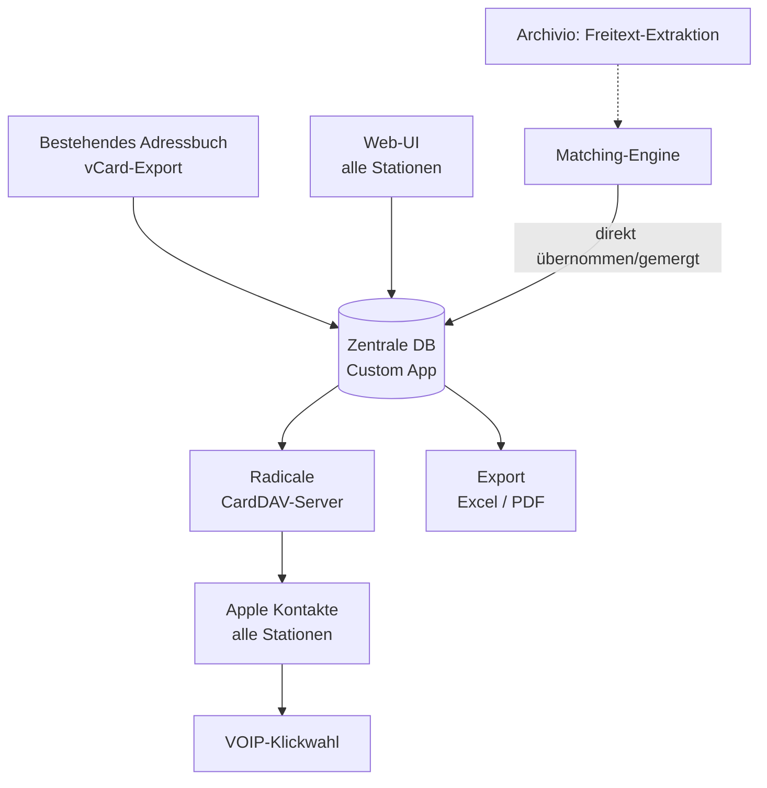
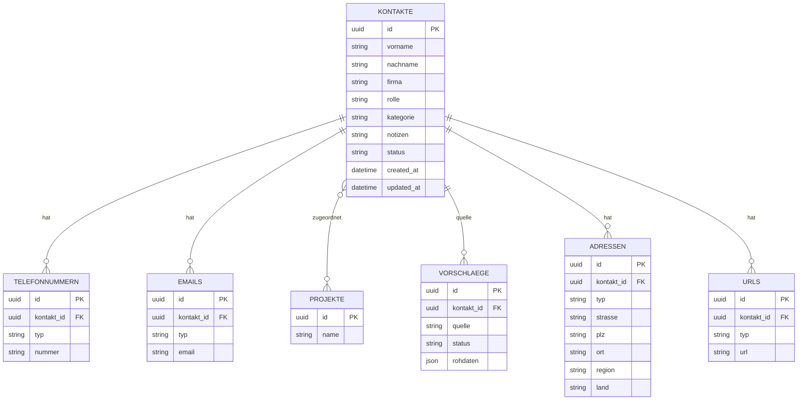

# Rubrica – Technisches Konzept

Dieses Dokument fasst das Konzept für Rubrica, eine zentrale Adressverwaltung, zusammen und dient als Grundlage für die Umsetzung (z. B. mit Claude Code). Es liegt im Repo unter `docs/konzept.md` und wird bei jeder relevanten Änderung/Anpassung nachgeführt, damit es als aktuelle Referenz für alle weiteren Entwicklungsschritte verfügbar bleibt.

Entwicklung erfolgt auf einem Entwicklungs-Mac, das fertige Produkt läuft produktiv auf einem Server-Mac im Büro.

## 1. Ausgangslage

Aktuell wird das Apple Adressbuch genutzt und laufend um Fachplaner und Unternehmer ergänzt. Probleme:

- Neue Kontakte müssen manuell exportiert und bei allen Mitarbeitern importiert werden – kein echter Sync.
- Das Adressbuch ist nie vollständig, weil Mitarbeiter neue Kontakte vergessen anzulegen oder nicht teilen.
- Vorteil des aktuellen Setups, der erhalten bleiben soll: direkte Verbindung zur VOIP-Telefonapp, Klickwahl ohne Kopieren.

## 2. Ziele

1. Zentrale, für alle Stationen automatisch synchronisierte Adressverwaltung.
2. Eingabe/Änderung von jeder Station aus möglich.
3. Automatische Erkennung neuer Adressen aus E-Mails (über Archivio), aber **nie automatisches Überschreiben** bestehender Daten – Vorschläge müssen manuell bestätigt werden.
4. Export als Excel und PDF.
5. Telefonnummern weiterhin per Klick über die VOIP-App wählbar, ohne Copy-Paste.
6. Kontakte können einem oder mehreren Ordnern zugewiesen werden, sichtbar als Gruppen im Apple Adressbuch.
7. Bestehendes Apple Adressbuch (inkl. mehrerer, teils überlappender Mitarbeiter-Kopien) als Grundlage importierbar.

## 3. Architekturübersicht

Kernprinzip: Die selbst gebaute App ist die alleinige Datenquelle ("Single Source of Truth"). Ein selbst gehosteter CardDAV-Server (Radicale) ist nur die Auslieferungsschicht zu Apple Kontakte – kein zweites System, das synchron gehalten werden muss.


```mermaid
flowchart TB
    A[Bestehendes Adressbuch<br/>vCard-Export] --> D
    B[Web-UI<br/>alle Stationen] --> D
    C[Archivio: Freitext-Extraktion] -.-> M[Matching-Engine]
    M -->|direkt übernommen/gemergt| D[(Zentrale DB<br/>Custom App)]
    D --> R[Radicale<br/>CardDAV-Server]
    R --> K[Apple Kontakte<br/>alle Stationen]
    K --> V[VOIP-Klickwahl]
    D --> E[Export<br/>Excel / PDF]
```

Deployment: kein Docker. Die App läuft als natives, über ein `.pkg` installiertes Programm auf einem Mac im Büro – gleiches Vorgehen wie bei der Referenzimplementierung Archivio (siehe `CLAUDE.md`). Python-Interpreter und alle Abhängigkeiten (FastAPI, Radicale, etc.) werden vollständig ins Paket gebündelt, sodass keine separate Python-Installation nötig ist. Backend-App und Radicale laufen als Kindprozesse einer Menubar-App, die über einen launchd-Dienst beim Systemstart automatisch startet. Andere Stationen greifen rein lokal über das Büro-LAN zu (Web-UI per Browser, CardDAV-Account in Kontakte.app), z. B. über den Bonjour-Hostnamen des Server-Macs (`<name>.local`) – keine externe Erreichbarkeit nötig.

Claude Code sollte sich für den Paketierungs-Ansatz (pkg-Build, launchd-Plists, Bibliothekspfade) am bestehenden Code der Referenzimplementierung Archivio orientieren (siehe `CLAUDE.md` für den Pfad), damit beide Tools demselben Muster folgen.

## 4. Datenmodell


```mermaid
erDiagram
    KONTAKTE ||--o{ TELEFONNUMMERN : hat
    KONTAKTE ||--o{ EMAILS : hat
    KONTAKTE }o--o{ PROJEKTE : zugeordnet
    KONTAKTE ||--o{ VORSCHLAEGE : quelle
    KONTAKTE ||--o{ ADRESSEN : hat
    KONTAKTE ||--o{ URLS : hat
    KONTAKTE {
        uuid id PK
        string vorname
        string nachname
        string firma
        string rolle
        string kategorie
        string notizen
        string status
        datetime created_at
        datetime updated_at
    }
    TELEFONNUMMERN {
        uuid id PK
        uuid kontakt_id FK
        string typ
        string nummer
    }
    EMAILS {
        uuid id PK
        uuid kontakt_id FK
        string typ
        string email
    }
    ADRESSEN {
        uuid id PK
        uuid kontakt_id FK
        string typ
        string strasse
        string plz
        string ort
        string region
        string land
    }
    URLS {
        uuid id PK
        uuid kontakt_id FK
        string typ
        string url
    }
    PROJEKTE {
        uuid id PK
        string name
    }
    VORSCHLAEGE {
        uuid id PK
        uuid kontakt_id FK
        string quelle
        string status
        json rohdaten
    }
```

Wichtig: `VORSCHLAEGE.status` (offen / bestätigt / abgelehnt) ist getrennt von `KONTAKTE.status`. Ein Treffer aus Archivio oder aus dem Import verändert nie direkt einen bestehenden Kontakt, sondern erzeugt einen Eintrag in `VORSCHLAEGE`, der erst nach manueller Bestätigung übernommen wird.

Feldumfang bewusst an der tatsächlichen Nutzung im bestehenden Apple-Adressbuch ausgerichtet (Stichprobe 1538 Kontakte, Stand 22.06.2026): Telefon/E-Mail (fast durchgängig genutzt), Postadresse (1417), Notizen (755) und Homepage/URL (559) sind abgedeckt. Selten genutzte Apple-Felder (Geburtstag, Spitzname, Social-Profile, Instant-Messenger, verwandte Namen — je unter 1.3 % der Kontakte) werden bewusst nicht abgebildet, um das Datenmodell schlank zu halten; bei Bedarf später einfach ergänzbar.

## 5. Komponenten im Detail

### 5.1 Zentrale App (Backend + Web-UI)
- Verwaltet CRUD auf Kontakte (inkl. Telefonnummern, E-Mails, Adressen, URLs, Notizen), Ordner.
- **Direktes Neuanlegen von Kontakten über die Web-UI (`/kontakte/neu`, umgesetzt 2026-07-12).**
  *Revidiert die ursprüngliche Entscheidung „bewusst keine Neuanlage".* Grund: Das Kernproblem des Büros
  ist, dass Kontakte **gar nicht erst erfasst** werden (Wissen bleibt bei Einzelpersonen). „In Kontakte.app
  anlegen → exportieren → importieren" ist genau die Reibung, die das verhindert. Ein Web-Formular zum
  Neuanlegen braucht **keinen** bidirektionalen Sync (Rubrica bleibt Single Source of Truth, pusht einseitig
  zu Apple) und ist daher voll mit dem Architekturprinzip vereinbar. Das Formular ist bewusst minimal und
  mobiltauglich. **Reibungssenker: E-Mail-Signatur einfügen** → `importer/signatur.py` parst sie und füllt
  die Felder vor (danach editierbar). Kontakte werden **direkt angelegt** (kein Freigabe-Gate — Reibung
  würde die Erfassung verhindern), nachträglich korrigierbar. Der bisherige Weg (Import aus Kontakte.app,
  5.6) bleibt zusätzlich bestehen.
- **Feld „Funktion"** (Fachrichtung: Architekt, Bauingenieur, Geologe, div. Planer …) pro Kontakt, damit der
  Chef nach Ansprechpartner-Rolle filtern/exportieren kann. Auswahlliste + Freitext (nicht erzwungen).
  Technisch im bestehenden Feld `kategorie` gespeichert (nur UI-Label „Funktion"), keine DB-Migration.
- **Push-Sync nach Radicale** (`sync/radicale.py`): bei jeder Kontakt-Änderung/-Löschung, Ordner-Zuordnung
  oder Vorschlag-Bestätigung schreibt die App die betroffene(n) vCard(s) per CardDAV `PUT` (Legt die
  Adressbuch-Collection bei Bedarf automatisch per `MKCOL` an). Deterministisches UID-Schema:
  `kontakt-{id}` / `projekt-{id}`, keine zusätzliche Spalte nötig. Konfigurierbar über `radicale.*` in
  `config.yaml`, standardmässig deaktiviert (`enabled: false`) — ohne Konfiguration bleibt die App voll
  funktionsfähig, Sync-Fehler (Radicale nicht erreichbar) werden geloggt, nie als Fehler an die Web-UI
  durchgereicht.

### 5.2 CardDAV-Layer (Radicale)
- Leichtgewichtiger, dateibasierter CardDAV-Server, für 6–15 Nutzer ausreichend dimensioniert.
- Wird als Python-Abhängigkeit ins `.pkg` gebündelt und läuft als eigener launchd-Dienst neben dem Backend; wird von der App beschrieben (App schreibt, Radicale liefert nur aus).
- ~~**Kritischer Punkt – zuerst testen:**~~ **Erledigt (2026-07-10):** Apple hält sich bei Kontaktgruppen nicht an den offiziellen vCard4-Standard (`KIND:group`/`MEMBER`), sondern nutzt proprietäre Properties (`X-ADDRESSBOOKSERVER-KIND`, `X-ADDRESSBOOKSERVER-MEMBER`) — per Spike auf einem iPhone verifiziert, Gruppe erscheint korrekt mit Mitgliedern (siehe Abschnitt 9).
- **Wichtiger Praxis-Befund aus dem Spike:** macOS/iOS Kontakte.app führt bei manuellem CardDAV-Setup ("Erweitert") immer eine HTTPS-Autodiscovery auf den Ports 8443/8843/443 durch, unabhängig vom eingetragenen Port. Radicale muss daher HTTPS auf einem dieser Ports anbieten (Dev: selbstsigniertes Zertifikat, automatisch von `scripts/radicale-dev.sh` erzeugt; Produktivbetrieb: siehe Abschnitt 7).
- Auth: `htpasswd` mit bcrypt (`config/radicale.conf.example`), Passwort setzen via `scripts/radicale_set_password.py <user> <passwort>`.

### 5.3 Datenablage
- Konfiguration und SQLite-DB liegen unter `~/Library/Application Support/Rubrica/` (analog zum Archivio-Vorgehen, Pfad steuerbar über `RUBRICA_DATA_DIR`).
- Radicales vCard-Speicher liegt als Unterordner im selben Application-Support-Verzeichnis, damit ein Backup des gesamten Ordners reicht, um alles zu sichern.

### 5.4 Ordner-Zuordnung
- Nutzerseitig "Ordner" genannt, intern weiterhin `KONTAKTE ↔ PROJEKTE` als many-to-many (Tabellen-/Schema-Name bewusst unverändert, siehe unten) — ein Kontakt kann mehreren Ordnern zugeordnet sein.
- Pro Ordner erzeugt die App eine Gruppen-vCard in Radicale (siehe 5.2/5.1), die als Apple-Kontaktgruppe mit Ordnername erscheint. Bei jeder Änderung der Zuordnung (Kontakt bearbeitet, gelöscht, Vorschlag bestätigt) werden sowohl der alte als auch der neue Ordner neu geschrieben, damit Mitglieder korrekt hinzugefügt/entfernt werden.

### 5.5 Archivio-Integration (zurückgestellt auf Phase 4, siehe Abschnitt 8)
- **Wichtig:** Es gibt aktuell noch keine SQL-DB mit fertig strukturierten Adressdaten. Archivio scannt Dokumente auf dem Server sowie E-Mails im Postfach und extrahiert deren Inhalt als Rohtext in eine SQL-DB. Adressdaten sind darin also nicht als eigene Felder vorhanden, sondern höchstens innerhalb des extrahierten Fließtexts auffindbar – z. B. in einer E-Mail-Signatur.
- Das bedeutet: Bevor eine Matching-Engine gebaut werden kann, braucht es zusätzlich eine Extraktionslogik (Erkennung von Name/Firma/Telefon/E-Mail innerhalb von Freitext, z. B. Signaturen). Das ist ein eigenständiges, nicht triviales Teilproblem.
- Dieser Teil ist bewusst kein Bestandteil der ersten Umsetzung, sondern wird erst angegangen, wenn Phase 1–2 stehen. Der bestehende Archivio-Code (siehe `CLAUDE.md` für den Pfad) sollte zu gegebener Zeit als Referenz für das tatsächliche SQL-Schema herangezogen werden, bevor die Extraktions- und Matching-Logik entworfen wird.
- Grundprinzip bleibt aber von Anfang an gültig und sollte im Datenmodell (Tabelle `VORSCHLAEGE`) schon
  vorgesehen sein: kein Treffer → neuer Kontakt; Treffer mit abweichenden Daten → nie destruktive
  Änderung, nur Ergänzung leerer Felder (siehe docs/CHANGELOG-INTERN.md, "Review-Queue komplett entfernt").

### 5.6 Import bestehender Adressbücher — dauerhafter Eingabeweg, nicht nur Einmal-Migration
- Export als `.vcf` aus Kontakte.app (Ablage → Exportieren → vCard exportieren) bei jedem Mitarbeiter. Sowohl Einzel-Export (ein Kontakt) als auch Batch-Export (alle/mehrere Kontakte in einer Datei) werden unterstützt; mehrere Dateien gleichzeitig hochladbar.
- **Import bleibt *ein* Weg der Erfassung (neben der direkten Web-Neuanlage, siehe 5.1), aber der einzige aus Kontakte.app zurück.** Grund: eine echte bidirektionale CardDAV-Synchronisation (Kontakte.app ↔ App) würde das Kernprinzip "nie automatisches Überschreiben" aushebeln, weil Änderungen aus Kontakte.app dann ungeprüft durchschlagen würden. Radicale bleibt nur Ausgaberichtung (App → Apple Kontakte für Klickwahl); die Rückrichtung aus Kontakte.app bleibt bewusst Export → Import → direkte Übernahme (siehe docs/CHANGELOG-INTERN.md, "Review-Queue komplett entfernt"). (Direktes Neuanlegen in der Web-UI umgeht Kontakte.app ganz und ist davon unberührt.)
- Import-Parser mappt vCard-Felder auf das Datenmodell: Name, Firma, Rolle, Telefonnummern, E-Mails, Postadressen (ADR), Homepage/URLs, Notizen (NOTE).
- Da mehrere, teils überlappende Mitarbeiter-Kopien existieren: alle Exporte importieren und dieselbe Dedup-/Merge-Logik (siehe `VORSCHLAEGE`-Tabelle, `queries.merge_kontakt`) nutzen – keine zweite Logik nötig, auch nicht für die Archivio-Integration. Matching-Reihenfolge: exakte E-Mail → normalisierte Telefonnummer → exakter Vor-/Nachname.
- Bestehende lokale Gruppen aus dem Import können optional als erste Ordner übernommen werden (Apple-Gruppen-vCards mit `X-ADDRESSBOOKSERVER-KIND`/`MEMBER`, in der Praxis am bestehenden Adressbuch verifiziert: ~32 Gruppen bei 1538 Kontakten).

### 5.7 Export
- **Umgesetzt (Phase 3, 2026-07-12):** `/export` — Nutzer wählt einen Ordner (oder "Alle Kontakte") und
  ein oder mehrere Formate (PDF, CSV, vCard), Rubrica liefert alle gewählten Dateien gebündelt als ein
  einziges ZIP-Archiv (`Ordnername_JJJJ-MM-TT.zip`) zum Download. Erzeugung in `export/generator.py`:
  - **PDF:** formatierte Liste (reportlab), pro Kontakt ein zusammenhängender Block (Name, Firma/Rolle,
    Telefon/E-Mail/Adresse/Web, Notizen), Titel + Datum + Anzahl Kontakte im Kopf.
  - **CSV:** Excel-kompatibel (Semikolon-getrennt, UTF-8 mit BOM für korrekte Umlaut-Darstellung in Excel).
  - **vCard:** eine `.vcf`-Datei mit allen Kontakten des Ordners (Mehrfach-vCard, direkt per Doppelklick in
    Kontakte.app importierbar) — nutzt dieselbe `kontakt_zu_vcard()`-Funktion wie der CardDAV-Sync
    (`sync/radicale.py`), keine doppelte Formatierungslogik.
  - Neue Abhängigkeit `reportlab==5.0.0` in `requirements.txt`.

### 5.8 Mail-Eingang — Kontakte von unterwegs per Mail einreichen
- **Umgesetzt (2026-07-28):** ein drittes Erfassungs­gleis neben Web-Neuanlage (5.1) und Import (5.6) für
  den Fall "von unterwegs", wo weder Web-UI noch Kontakte.app-Export praktikabel sind. Ein dediziertes
  IMAP-Postfach (z. B. `rubrica@musterfirma.ch`, in den Einstellungen konfigurierbar) kann per "Kontakt
  senden" aus Kontakte.app (vCard-Anhang) oder schlicht als Freitext (Name/Telefon/Mail) adressiert werden.
- Anders als Import/Archivio bleibt ein Mail-Vorschlag bewusst auf `vorschlaege.status = 'offen'` stehen,
  bis er manuell auf einer eigenen Seite (`/mail-vorschlaege`) bestätigt oder abgelehnt wird — ein von
  außen erreichbares Postfach ist ein weniger vertrauenswürdiger Kanal als die anderen beiden Wege, die
  vom Büro-Rechner selbst ausgehen. `VORSCHLAEGE.quelle = 'mail'` (Migration ergänzt diesen Wert plus eine
  `message_id`-Spalte für den Dublettenschutz derselben Mail).
- Nur lesend gegenüber dem Postfach: IMAP `SELECT` readonly + `FETCH BODY.PEEK[]`, kein
  `STORE`/`EXPUNGE`/`DELETE` (`mail_intake.py`, angelehnt an die Mail-Scan-Logik der Referenzimplementierung
  Archivio, siehe `CLAUDE.md` für den Pfad). vCard-Anhang hat Vorrang vor dem Mailtext; ohne Anhang wird der
  Text wie eine Signatur geparst (dieselbe Heuristik wie beim "Aus Signatur übernehmen"-Feld,
  `importer/signatur.py`).
- Abruf 1× täglich automatisch (Hintergrund-Thread in `web/main.py`, analog zum Updater-Check der
  Menubar-App) sowie manuell über einen "Jetzt prüfen"-Knopf in den Einstellungen.

## 6. Vorgeschlagener Tech-Stack

| Bereich | Empfehlung | Begründung |
|---|---|---|
| Backend | Python + FastAPI | Gleiche Sprache wie Radicale, gut dokumentiert, KI-Coding-freundlich |
| Datenbank | SQLite | Datenmenge ist klein (Kontaktliste), keine separate DB-Infrastruktur nötig, einfache Backups. Bei Bedarf später auf Postgres migrierbar |
| Frontend | Server-seitig gerendert (Jinja2 + htmx) | Keine npm-Build-Pipeline nötig, für einen Solo-Entwickler mit KI-Unterstützung deutlich einfacher zu warten als eine SPA |
| CardDAV | Radicale | Siehe 5.2, als Python-Abhängigkeit gebündelt |
| Paketierung | `.pkg`-Installer, launchd-Dienste | Gleiches Vorgehen wie bei Archivio, kein Docker, läuft nativ auf dem iMac |
| Datenablage | `~/Library/Application Support/Rubrica/` | Konfiguration und SQLite-DB an einem Ort, einfaches Backup |
| Versionierung | Git, Remote auf GitHub | Wie gewünscht |

Dies ist ein Startvorschlag – bei Bedarf anpassbar, insbesondere falls beim Bauen mit Claude Code eine andere Sprache bevorzugt wird.

## 7. Zugriff & Sicherheit

Geklärt: Zugriff erfolgt vorerst ausschließlich lokal im Büro-LAN, kein Remote-Zugriff nötig. Web-UI weiterhin per einfachem HTTP im lokalen Netz erreichbar (`<name>.local`), kein Reverse-Proxy nötig.

**Revidiert durch Phase-2-Spike-Erfahrung:** Für CardDAV (Radicale) ist HTTPS entgegen der ursprünglichen Annahme doch nötig — macOS/iOS Kontakte.app führt beim Account-Setup immer eine HTTPS-Autodiscovery durch (siehe Abschnitt 5.2/9), unabhängig von der eigentlichen LAN-only-Anforderung. Für den Produktivbetrieb auf dem iMac:
- **Auth**: `htpasswd`/bcrypt (siehe 5.2) statt der im Spike genutzten `auth.type=none`.
- **TLS-Zertifikat**: Dev nutzt ein selbstsigniertes Zertifikat (pro Gerät manuell als vertrauenswürdig bestätigen). Für den echten Rollout auf mehreren Stationen sollte ein einmal erzeugtes, auf allen Stationen als vertrauenswürdig hinterlegtes Zertifikat verwendet werden (z. B. eigene lokale CA à la `mkcert`), damit nicht jede Station einzeln den "nicht vertrauenswürdig"-Dialog bestätigen muss. Das ist ein offener Punkt für die Rollout-Phase, noch nicht umgesetzt.

## 8. Phasenplan

| Phase | Inhalt |
|---|---|
| 0 | Import bestehender Adressbücher (alle Mitarbeiter-Exporte) + Dedup über Review-Queue |
| 1 | Zentrale DB + Web-UI für manuelle Eingabe (löst das Kernproblem bereits) |
| 2 | Radicale-Anbindung inkl. Apple-Gruppen-Spike – **zuerst isoliert testen**, bevor der Rest darauf aufbaut |
| 3 ✅ | Export-Funktionen (PDF/CSV/vCard, pro Ordner, siehe Abschnitt 5.7) |
| 4 *(zurückgestellt)* | Archivio-Integration: zunächst Schema-Sichtung + Extraktionslogik für Adressdaten aus Freitext, danach Matching-Engine. Startet erst, wenn Phase 1–3 stehen und Archivios SQL-Schema bekannt ist |

## 9. Offene Punkte / Risiken

- ~~Apple-Gruppen-Kompatibilität (proprietäres vCard-Format) – größtes technisches Risiko, früh verifizieren.~~
  **GELÖST (2026-07-10).** Radicale (3.7.6, läuft unter Python 3.9) verarbeitet und liefert eine
  Gruppen-vCard (`X-ADDRESSBOOKSERVER-KIND:group` + `-MEMBER:urn:uuid:...`) über CardDAV korrekt aus
  (`MKCOL`/`PUT`/`GET`/`PROPFIND` per curl verifiziert). **Auf einem iPhone als CardDAV-Account
  eingerichtet erscheint die Gruppe "Rubrica Testprojekt" korrekt mit den zugehörigen Testkontakten
  als Mitglieder** — das Kernrisiko ist damit ausgeräumt.
- ~~macOS Kontakte.app holt nach dem Verbinden nie die Kontaktdaten ab (nur Discovery, nie `REPORT`) –
  eingeordnet als macOS-Einschränkung.~~ **URSACHE GEFUNDEN & GELÖST (2026-07-10). War kein macOS-Bug,
  sondern ein nicht-konformes TLS-Zertifikat.** Symptom: macOS Kontakte.app (Sonoma 14.8.2) machte nach
  dem Verbinden nur Discovery (`PROPFIND`/`OPTIONS`), nie einen `REPORT`; die Kontakte blieben leer, teils
  Meldung "Accountname/Passwort konnte nicht überprüft werden". iOS funktionierte, weil man dort das
  Zertifikat per Dialog **manuell** bestätigt (Trust-Override) — der macOS-Sync-Daemon
  (`dataaccessd`/`contactsd`) validiert dagegen strikt und bricht **vor** dem `REPORT` still ab.
  - **Beleg (Unified Log, `trustd`):** `[com.apple.securityd:ev] Leaf has invalid basic constraints`.
  - **Ursache im Detail:** Das selbstsignierte Zertifikat aus dem alten Build-Skript
    (`openssl req -x509 -days 3650`, nur `subjectAltName`) verletzte gleich mehrere Apple-Anforderungen an
    TLS-Server-Zertifikate: (a) **keine `basicConstraints`** → ein Zertifikat, das zugleich eigener
    Trust-Anchor und Server-Leaf ist, scheitert an Apples Constraint-Prüfung; (b) **kein
    `extendedKeyUsage=serverAuth`**; (c) **Gültigkeit 3650 Tage** statt der von Apple erzwungenen
    **≤ 398 Tage** (support.apple.com/en-us/HT211025).
  - **Lösung:** neues `scripts/generate-cert.sh` erzeugt eine lokale **CA** + davon signiertes **Leaf**
    (`CA:FALSE`, `keyUsage=digitalSignature,keyEncipherment`, `extendedKeyUsage=serverAuth`, SAN mit
    Hostname, 397 Tage, SHA-256/RSA-2048) — dasselbe Prinzip wie `mkcert`. Radicale liefert die Full-Chain
    (Leaf + CA) aus; die CA wird auf jedem Client **einmalig** als vertrauenswürdig markiert. Der
    `.pkg`-Postinstall (`scripts/build-pkg.sh`) erzeugt das Zertifikat und markiert die CA per
    `security add-trusted-cert -d -r trustRoot -k /Library/Keychains/System.keychain` automatisch als
    vertrauenswürdig (läuft als root → kein Dialog). Vorteil des CA-Modells: Das jährlich ablaufende Leaf
    (398-Tage-Grenze) kann erneuert werden, ohne dass auf den Clients erneut vertraut werden muss.
  - **Manuell (bestehende Installation ohne neuen Postinstall, z. B. Mac Studio):** einmalig
    `sudo security add-trusted-cert -d -r trustRoot -p ssl -k /Library/Keychains/System.keychain \
    "~/Library/Application Support/Rubrica/radicale-tls/ca-cert.pem"`, danach alten CardDAV-Account
    entfernen und neu anlegen.
  - **Zu beachten beim "Erweitert"-CardDAV-Setup:** macOS prüft bei der Accountverifizierung immer HTTPS
    auf 8443/8843/443, unabhängig vom eingetragenen Port (s. `config/radicale.conf.example`).
- ~~macOS Kontakte.app synchronisiert nach behobenem TLS zwar fehlerfrei die Discovery, startet aber den
  eigentlichen Inhalts-Sync nicht.~~ **GELÖST (2026-07-12).** War ein macOS-Client-Zustandsproblem, kein
  Rubrica-/Radicale-Fehler — durch Vanilla-Radicale-Gegentest zweifelsfrei von Rubrica getrennt (siehe unten).
  - **Beweis, dass Rubrica nicht die Ursache war:** (a) iOS synchronisiert mit identischen Serverantworten
    zuverlässig; (b) ein frisches, leeres Vanilla-Radicale (kein Rubrica-Code, nur 2 Testkontakte) zeigte
    exakt dasselbe Symptom — Discovery ja, `REPORT` nie; (c) per mitschreibendem TLS-Proxy verifiziert, dass
    macOS die von ChatGPT vermuteten Properties (`getcontenttype`/`getcontentlength` auf der Collection)
    nie abfragt — diese Hypothese war falsch.
  - **Tatsächliche Ursache:** angesammelter Client-Zustand nach mehreren Setup-Versuchen (mehrere verwaiste,
    leere CardDAV-Quellen unter `~/Library/Application Support/AddressBook/Sources/`) **plus** Account-Setup
    im Modus **"Erweitert" mit explizitem Serverpfad** — das führte dazu, dass `contactsd` nach der
    Discovery keinen Inhalts-Sync ansetzte.
  - **Lösung:** (1) Account entfernen, Kontakte.app beenden, `killall contactsd`; (2) alle leeren,
    verwaisten CardDAV-Quellen aus `~/Library/Application Support/AddressBook/Sources/` entfernen
    (Quellen mit 0 Karten und vorhandener `AddressBook-v22.abcddb`; echte lokale Kontakte-Quellen mit
    Karteninhalt nicht anfassen); (3) Account **neu und im Modus "Manuell"** anlegen, **nur mit dem
    Hostnamen** (`<name>.local`), **ohne Port und ohne Pfad** — macOS macht dann die CardDAV-Autodiscovery
    über `/.well-known/carddav` selbst (wie beim iPhone) statt über einen fest eingetragenen
    Collection-Pfad. Danach sendete macOS sofort mehrere `addressbook-multiget`-REPORTs und alle Kontakte +
    Gruppen kamen korrekt an (verifiziert auf einem Entwicklungs-Mac).
  - **Für den Produktiv-Rollout:** Account **immer** im Modus "Manuell" mit nur dem Hostnamen anlegen, nie
    "Erweitert" mit explizitem Pfad — auch wenn beide Modi denselben Server ansprechen, verhält sich
    `contactsd` beim Auslösen des initialen Inhalts-Syncs unterschiedlich.
- Archivio enthält aktuell keine strukturierten Adressdaten, nur extrahierten Freitext (z. B. Mail-Signaturen) – die Extraktion daraus ist ein eigenständiges Teilproblem und bewusst auf später verschoben.
- pkg-Bündelung von Python + Radicale + Abhängigkeiten sollte sich eng am bestehenden Archivio-Build orientieren, um doppelte Lösungswege für dasselbe Problem zu vermeiden.
- SQLite-Eignung bei tatsächlicher Nutzung validieren (bei diesem Datenvolumen unkritisch, aber gleichzeitige Schreibzugriffe im Auge behalten).

## 10. Repo-Struktur

Flache Struktur analog zur Referenzimplementierung Archivio (siehe `CLAUDE.md` für den Pfad) statt einer `backend/frontend/packaging`-Aufteilung – gleiches, bewährtes Muster für Config-Loading, DB-Connection und spätere `.pkg`-Paketierung, keine doppelten Lösungswege für dasselbe Problem.

```
rubrica/
├── docs/
│   └── konzept.md          # dieses Dokument
├── config/
│   └── settings.py          # config.yaml laden/speichern (RUBRICA_DATA_DIR)
├── db/
│   ├── schema.sql
│   ├── connection.py
│   └── migrations.py
├── web/
│   ├── main.py               # FastAPI App-Factory
│   ├── contacts.py
│   ├── projects.py
│   ├── review.py
│   ├── templates/
│   └── static/
├── scripts/
│   ├── setup.sh
│   └── dev.sh
├── tests/
├── requirements.txt
├── config.yaml.example
├── CLAUDE.md
└── README.md
```

Radicale-Anbindung, launchd-Plists und `.pkg`-Build (Phase 2 ff.) werden zu gegebener Zeit ergänzt, sobald diese Phasen beginnen.

---

Ein fortlaufender, datierter Entwicklungs-Changelog mit vollständiger Umsetzungshistorie liegt in
`docs/CHANGELOG-INTERN.md` — **nicht Teil dieses Dokuments**, da er reale Namen, Maschinennamen, Pfade und
Kontaktzahlen aus der produktiven Nutzung enthält und deshalb nie an andere Büros weitergegeben werden darf.

